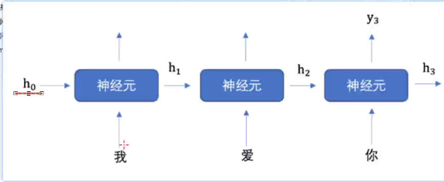
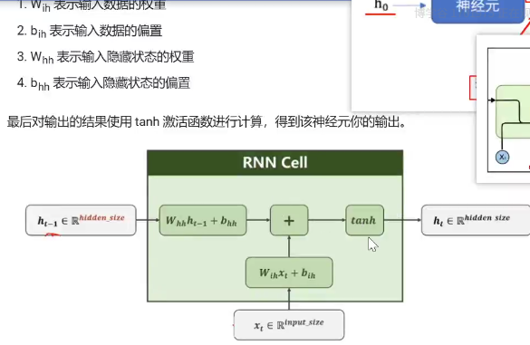
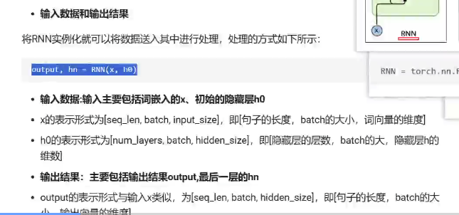

### RNN

NLP研究的主要是用故宫计算机算法来理解自然语言。处理的数据就是人类的语言例如：汉语，英语。数据不像前面的结构化数值数据，也不像图像数据方便进行数值化。

分词，词表映射，构建词与索引的映射。

索引的onehot编码乘以词嵌入层。

#### 词嵌入

词嵌入层的作用就是将文本转化为向量。

词嵌入层会根据词表构建一个词向量矩阵，输入的每一个词都对应该矩阵中的一个向量。

PyTorch中使用nn.Embedding实现词嵌入层。

#### RNN结构

门控逻辑变体

LSTM，GRU

pytorch应用

torch.nn.RNN(input_size,hidden,num_layer)

输入维度即词向量维度，输出维度和隐藏层h维度，隐藏层数

