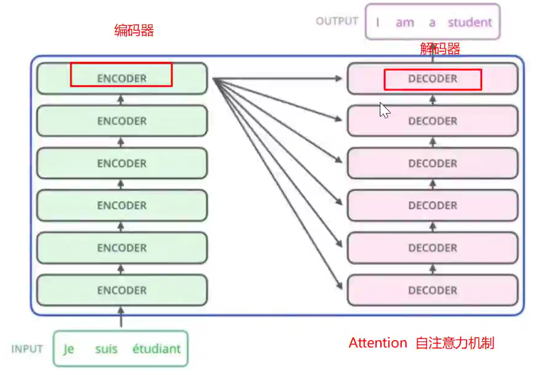
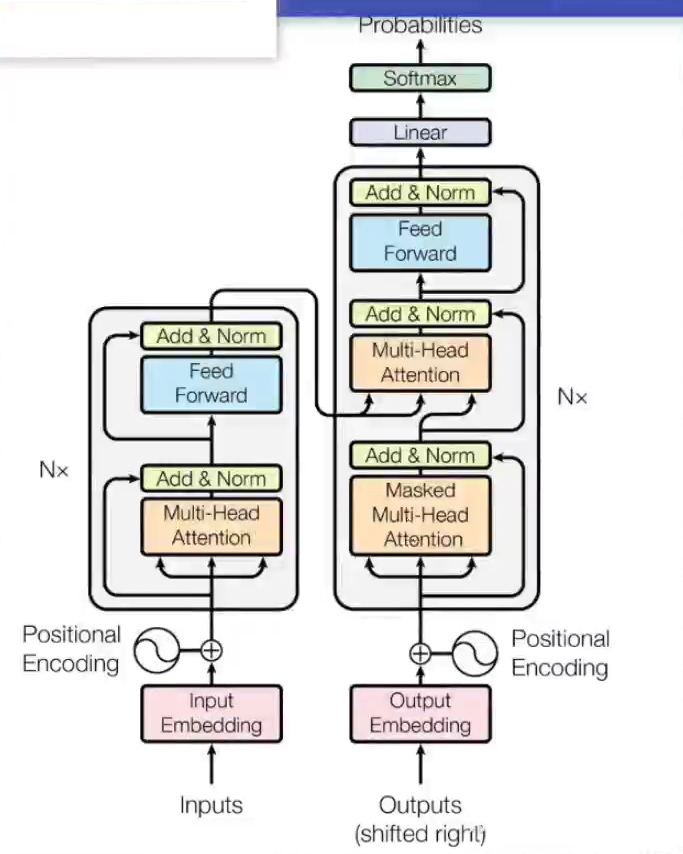
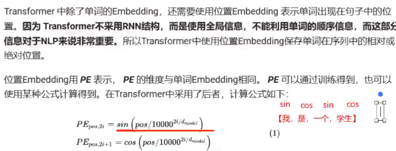
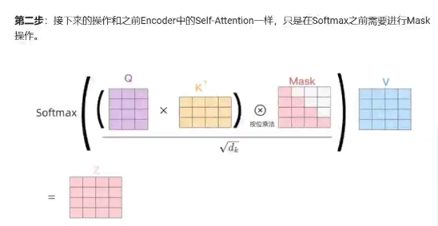

Transormer

Transformer 是一种基于[自注意力机制](https://so.csdn.net/so/search?q=自注意力机制&spm=1001.2101.3001.7020)（Self-Attention）的神经网络架构，由 Vaswani 等人在 2017 年提出。它在自然语言处理（NLP）任务中表现出色，最初是设计用于机器翻译领域。

### transformer的结构

Transformer 的核心组件包括：

编码器（Encoder）：将输入序列（如中文句子）转换为一系列隐藏表示。

解码器（Decoder）：基于编码器的输出和已生成的目标序列（如英文句子）生成下一个词。

自注意力机制（Self-Attention）：捕捉序列中每个词与其他词的关系。

位置编码（Positional Encoding）：为模型提供序列中词的位置信息。2. Transformer 的优势

1.词向量embedding+位置embedding得到词向量矩阵

2.词向量编码矩阵输入编码器，得到编码矩阵

3.输出的编码矩阵进入解码器配合带掩码的预测序列编码矩阵输出下一个词的预测。

多头注意力机制

softmax（QKT/d）V

### Transformer的优势

- **并行计算**：与 RNN 不同，Transformer 可以并行处理整个序列，训练速度更快。
- **长距离依赖**：自注意力机制能够更好地捕捉长距离依赖关系。
- **可扩展性**：Transformer 可以通过堆叠更多的层来提升性能。

所以说，Transformer “本身计算出来的东西”**最核心、最直接**的就是**注意力权重**以及基于它的**加权聚合值**。这就是Transformer捕获长距离依赖和上下文信息的关键所在。

**Attention(Q_i, K_i, V_i) = softmax((Q_i * K_i^T) / sqrt(d_k)) * V_i**

Q和K的每个头矩阵映射的维度必须相同，否则Q和K的转置无法相乘。Q和K的转置相乘的结果一定是方阵。但是V的头矩阵映射的维度可以与Q和K不同是吧。

1. **Q 和 K 的每个头映射维度必须相同：**
   - 完全正确。每个注意力头 `i` 计算注意力分数时，需要执行操作：`Attention(Q_i, K_i, V_i) = softmax((Q_i * K_i^T) / sqrt(d_k)) * V_i`
   - 这里 `Q_i` 的维度是 `[seq_len, d_k_i]` (或 `[batch_size, seq_len, d_k_i]`)，`K_i` 的维度是 `[seq_len, d_k_i]`。
   - 为了进行矩阵乘法 `Q_i * K_i^T`，`Q_i` 的**列数** (`d_k_i`) 必须等于 `K_i^T` 的**行数**（也就是 `K_i` 的**列数**，即 `d_k_i`）。因此，`Q_i` 和 `K_i` **在每个头内部**的投影维度 `d_k_i` **必须相同**。
   - 结果 `Q_i * K_i^T` 的维度是 `[seq_len, seq_len]`，确实是一个**方阵**（行数和列数都等于序列长度 `seq_len`）。

1. **V 的每个头映射维度可以与 Q/K 不同：**
   - **完全正确！** 这是非常重要的一点。
   - 注意力权重的计算 (`softmax((Q_i * K_i^T) / sqrt(d_k)`) 只依赖于 `Q_i` 和 `K_i`，其输出维度是 `[seq_len, seq_len]`（注意力权重矩阵）。
   - 接下来，这个注意力权重矩阵需要乘以值矩阵 `V_i`：`softmax(...) * V_i`。
   - `V_i` 的维度是 `[seq_len, d_v_i]` (或 `[batch_size, seq_len, d_v_i]`)。
   - 矩阵乘法 `[seq_len, seq_len] * [seq_len, d_v_i]` 要求第一个矩阵的**列数** (`seq_len`) 等于第二个矩阵的**行数** (`seq_len`)。这个条件是满足的。
   - 结果的维度是 `[seq_len, d_v_i]`。**`d_v_i` 可以独立于 `d_k_i` 来选择！** 只要 `d_v_i` 是一个正整数，这个乘法在数学上就是成立的。

- **`d_k` (Q/K 投影维度)：** 在每个头内部，`Q` 和 `K` 必须投影到**相同的维度** `d_k_i`，以保证 `Q_i * K_i^T` 可计算。
- **`d_v` (V 投影维度)：** 在每个头内部，`V` 可以投影到**不同的维度** `d_v_i`。`d_v_i` 可以与 `d_k_i` **相同**，也可以**不同**。计算 `softmax(...) * V_i` 只要求序列长度维度匹配 (`seq_len`)，对 `d_v_i` 的值没有约束（除了必须是正整数）。

1. **核心计算：注意力权重**

   - Transformer（特别是其核心组件——自注意力机制）首先计算的是 `Q` (查询) 和 `K` (键) 向量之间的**相似度**。具体操作是 `Q * K^T`。
   - 这个相似度矩阵（`[seq_len, seq_len]`）经过缩放（除以 `sqrt(d_k)`）和 `softmax` 函数处理后，得到的就是**注意力权重矩阵（Attention Weights Matrix）**。
   - **这个权重矩阵本身就是“注意力”最直观的体现：**
     - 它表示对于序列中的**每一个位置（Query）**，模型应该**“注意”** 序列中**所有其他位置（Key）** 的程度。
     - `softmax` 确保了每一行（对应一个 Query）的权重和为 1，可以理解为该位置对序列中其他位置的**关注概率分布**。

2. **应用权重：加权求和**

   - 得到注意力权重后，Transformer 并不会直接输出这个权重矩阵。
   - 它会将这个权重矩阵应用于 `V` (值) 向量：`Output = AttentionWeights * V`。
   - 这个操作的含义是：**对于序列中的每一个位置（Query），其输出是该位置对所有位置（Key）的注意力权重与对应位置的值（Value）向量的加权和。**
   - **结果：** 每个位置最终输出一个向量（维度为 `d_v`），这个向量**融合了它根据注意力权重从整个序列中汇聚过来的相关信息**。这是自注意力模块的最终输出。

3. **Transformer 的输出是什么？**

   - **自注意力层（Self-Attention Layer）的输出：** 就是上面提到的加权和结果（`AttentionWeights * V`）。它代表了序列中每个位置基于注意力机制聚合上下文信息后的新表示。**这可以说是“注意力机制计算出来的结果”或“注意力输出”。**
   - **Transformer Block 的输出：** 自注意力层的输出还会经过：
     - **残差连接（Residual Connection）**：将自注意力层的输入加回到其输出上。
     - **层归一化（Layer Normalization）**
     - **前馈神经网络（Feed-Forward Network, FFN）**：对每个位置的向量进行非线性变换。
     - **又一个残差连接和层归一化。**
   - 一个 Transformer Block（Encoder Block 或 Decoder Block）的最终输出是经过所有这些操作处理后的序列表示。
   - **整个 Transformer 模型的输出：**
     - **Encoder：** 通常输出的是输入序列经过多层 Encoder Block 处理后的最终上下文表示（`[seq_len, d_model]`）。
     - **Decoder：** 在生成任务中，Decoder 的输出会通过一个线性层（通常称为 `lm_head`）映射到词汇表大小，然后经过 `softmax` 得到下一个词的概率分布。这个概率分布才是模型最终的预测输出（例如翻译结果、生成的文本等）。

   - **注意力权重 (`softmax(QK^T / sqrt(d_k))`)：** 表示“关注哪里”。
   - **自注意力层输出 (`AttentionWeights \* V`)：** 表示“根据关注点聚合后的信息是什么”。
   - **Transformer Block/Model 输出：** 表示“经过完整神经网络（包含注意力）处理后的最终结果”。