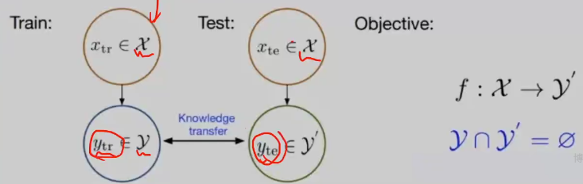

## 提示词工程

设计提示词直观控制大模型，无需微调模型。

从gpt3提出 one shot few shot属于提示词工程，样本以上下文的方式交给大模型。


写提示词的要点：

角色扮演和目标受众

明确表达需求 （介绍背景，用精确的语言具体化任务，分隔符）任务可以加入逐步推理的要求 step in step

提供充足上下文 （样本，私域数据）

结构化输出 json html

注意：分隔符的应用，``` """  <> <tag>  </tag>

迭代优化即可


提示词项目背景：

金融行业中有海量数据，怎么从海量数据获得有效信息。方便于风险评估，投资推荐


不依赖数据，依赖算力

通过提示词prompt激发大模型的泛化，涌现能力。


本项目基于大模型和提示词工程实现在金融领域相关任务的应用。


任务和方法介绍：

文本分类

文本信息抽取

文本匹配


基于chatglm-6b  基于few-shot one-shot设计prompt


zeroshot   根据老虎 马 熊猫 预测斑马 ，语言告诉斑马的特征，预测没有学习过的类别。



few  模型学习了大量样本后，用小样本做增量学习。


企业级大模型应用平台  开发大模型的软件

提供基座模型  模型训练 模型预测  提供算力和数据


