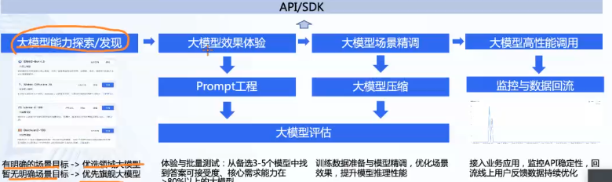
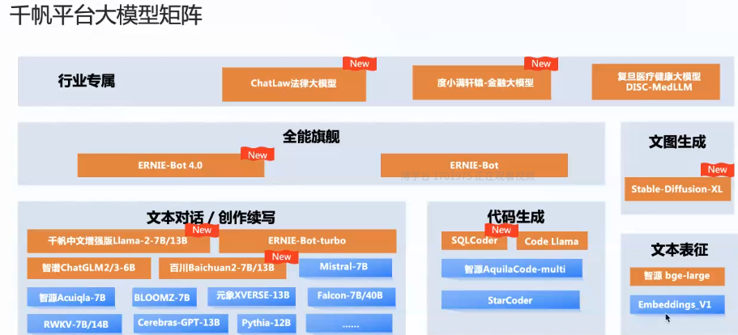

## 大模型定制平台

### 科大讯飞

#### 网页能力  Saas

星火大模型   理解推理生成  

多模态 代码 文本 数学能力 语言理解

讯飞智问生成ppt

#### api

登录官网  

星辰大模型定制平台

讯飞开发者平台  有开发者文档  技术支持

  

#### 星火大模型定制平台

 Saas平台

数据准备  定制大模型  模型训练 效果评估  发布上线

准本 csv jsonl  训练测试划分

微调  prompt  lora  全量微调

- 大模型微调平台星辰    

- 微调 语音大模型

  

### 百度千帆

文心一言是文心大模型toC的产品

文心千帆大模型平台是toB的产品，包括文心模型和开源模型的开发托管在线推理。

文心一言  大模型定制平台  数据清洗（处理文本数据）项目  模型训练 （posttrain垂直训练，sft有监督训练） 模型预测 应用 

### 阿里百炼

阿里百炼平台介绍

提供 基座通义大模型 行业大模型  第三方大模型

训练 推理 部署

数据中心 

数据管理  训练数据管理 企业知识库对接

数据处理  清洗 标注 

数据应用  训练数据生成  知识索引

大模型安全工具

模型中心  

模型效果对比

模型调优  sft lora  模型调优可视化

模型效果评估  评测维度管理 多模型评测对比

大模型应用

插件  实时搜索 文生图插件 code解释器 三方插件

prompt工程 prompt 模板 prompt优化

应用创建工具 看i原框架 流程

应用案例  rag 写作- 妙笔 客服-通义小安   gbi分析-析言

应用广场  一方应用 ai试衣  三方应用

模型部署 

api sdk输出    assident api  智能体发布

模型的数据和图表分析功能

图标要转化一下

基于阿里百炼平台做数据分析

阿里PAI

- 轻代码 
- 虚拟试衣

人体和衣物的融合

使用lora 训练

腾讯HAI

- 轻代码 
- 图像生成