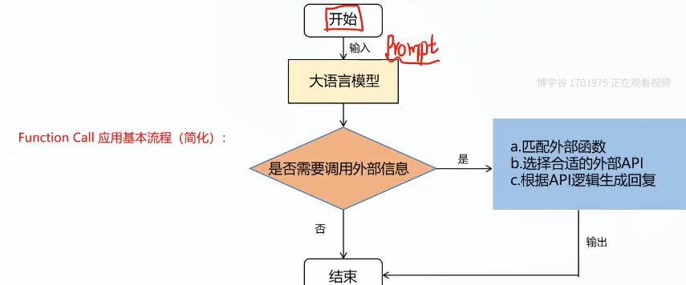
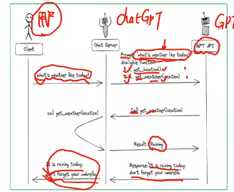
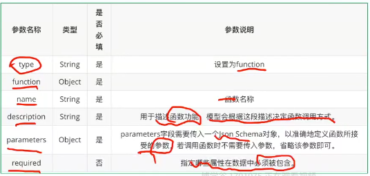
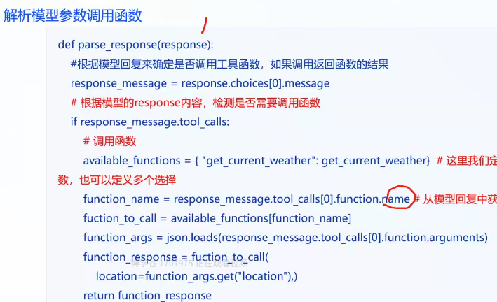
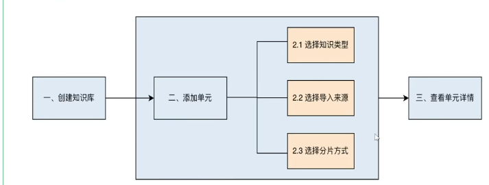
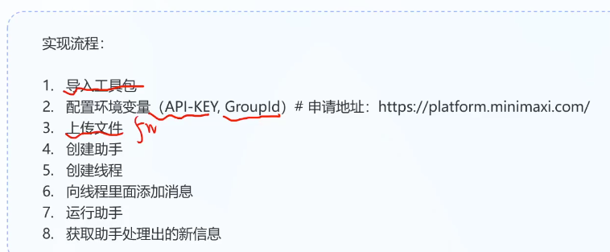
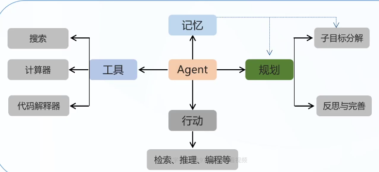
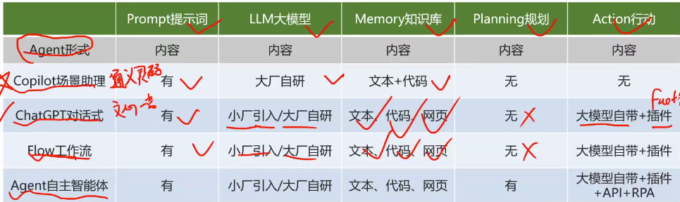

## agent

通过工程化让agent完成一些复杂的问题

属于大模型应用

人需要适应微信，若果是agent会适应人类。

o1是用来解决一些复杂任务的。

agent也是用来解决复杂问题的。

### function call

函数调用

以前大预言耐磨性处理文本

用api function训练大模型，让大模型使用api 和function

### 什么是function call

2023 6 23 openai 发布了functioncall 功能，旨在大预言模型中集成调用外部api的能力。

使用领域

信息实时性  天气 新闻 股价

数据局限性 获得特定领域的信息  比如全网搜索

功能扩展性 代码运行能力 计算器等等

### function 工作原理

client   server    gpt api

### 调用单一函数

部署模型，获取api  定义function_call  输入prompt到大模型，模型输出函数参数，调用本地函数得到返回，融入prompt，再次送入模型，获得结果。

3.10   pip install zhipuai

查询外部天气的函数，描述函数功能，解析模型参数调用函数

定义模型应用函数

### 调用多个函数

调用数据库

连接数据库查询的聊天机器人

database  表结构  字段

定义查询数据库的函数   描述函数功能tools 

## gpts

什么是gpts

再不写大模型的情况下，创建属于自己的gpt版本，通过prompt构建个人的ai助手。

coze

利用coze平台基于本地知识库快速搭建一个学习答疑的bot，

收集数据，基于coze搭建知识库，搭建bot，将coze连到平台实现应用。

| 模块                               | 说明                                                         |
| ---------------------------------- | ------------------------------------------------------------ |
| **基础模型**                       | 使用 GPT-4（或 GPT-3.5）作为底层大模型，具备强大的语言理解与生成能力。 |
| **提示工程（Prompt Engineering）** | 用户通过自然语言定义 GPT 的行为、语气、目标，系统将其转化为系统提示（System Prompt）注入对话。 |
| **知识增强**                       | 支持上传 PDF、TXT、CSV 等文件作为外部知识库，GPT 可在回答时检索这些资料。 |
| **能力插件（Actions）**            | 可调用外部 API（如 Zapier、天气、邮件、数据库等），实现联网搜索、图像生成、数据查询等功能。 |
| **多轮对话管理**                   | 支持上下文记忆、用户身份识别、对话状态追踪，提升交互体验。   |

https://github.com/chatchat-space/Langchain-Chatchat

GPTs = “大模型 + 低代码外壳” ≈ 会聊天的工具人；
Agent = “大模型 + 记忆 + 规划 + 工具（执行） + 循环” ≈ 真正能替你干活的数字员工。

## assistant api

gpts肯定不是维护多个大模型

几百万个gpts都是通过assistant api 维护的

#### 什么是assitant api

输入的role有：sys  user  assistant

gpts（面向用户的，通过指令，知识库定制化功能）    assistant api（是针对开发者  代码解释器    检索  function call  需要编写代码，构建自定义ui，自行发布。）

核心结构：

assistant：有特定目的的人工智能助手，使用openai的模型来滴哦用工具。

thread：代表助手和用户之间的对话，线程存储消息，并自动处理内容阶段，适应模型的上下文限制。

message：由助手和用户创建的消息。每个会话创建一个线程。

run：在线程上调用助手的一个实例，维护消息队列，通过调用模型和工具执行任务。

run： 助手运行过程中采取的消息步骤，调用工具，返回消息。

基于minimax开放平台的assistant api 开发一个水果收银助手，

## agent

三个开源项目

autogpt

斯坦福小镇，项目中的agent有了社会行为

chatdev

#### 什么是agent

agent  接受任务（获取需求后），感知环境，做出决策，执行动作。

不同于传统的人工智能，agent通过独立思考，调用工具完成目标

反应型agent，根据温度调节加热或制冷

目标导向agent，根据目标规划决策，根据思考来执行

学习型agent，根据经验优化规划和执行

当下的agent：是借助大语言模型的能力来解决问题的代理。

agent=LLM+记忆+任务规划+工具使用+行动的载体就是工具。

工作流程

设计提示词-》用户的需求

LLM理解，分析，规划，决策

记忆——》上下文组合和知识库，网页信息

拆解思考-》任务分解，进一步规划决策

行动-》执行

agent和传统软件有什么区别

传统流程固定，用户要适应流程

AIagent 是ai主导的，以目标导向的智能体。

传统的软件在有限设计流程，agent能实现无限的需求

#### agent的应用场景和实现工具

魔搭平台 大模型资源共享平台

CrewAI（基于longchain针对agent开发的封装）

#### 项目：

