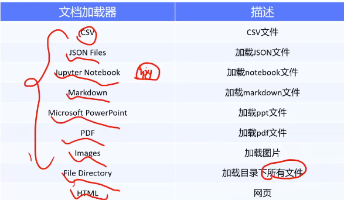
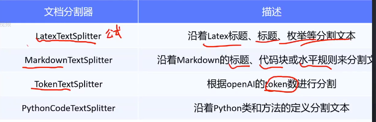
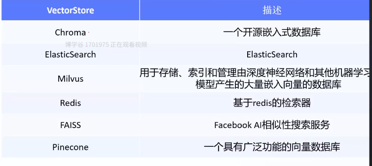
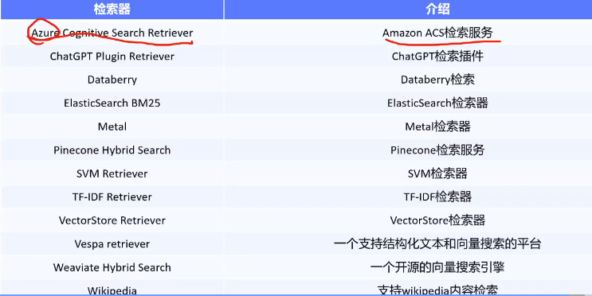
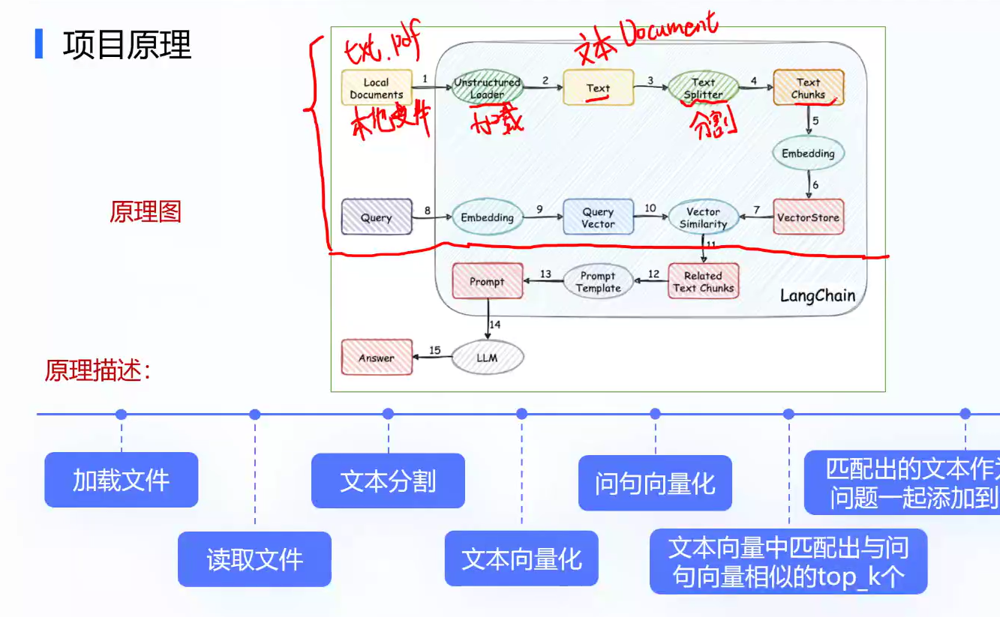
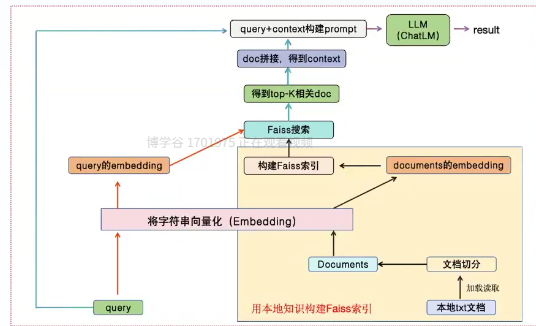

## langchain

gpt检查我们的思想和认知

llm来举例子

一句话总结

### 什么是Langchain

我们开发者通过 LangChain 提供的**标准化接口和可组合原语**，把 LLM、工具、数据、记忆等抽象成**可复用、可编排、可观测的模块**，按需组装成能解决特定问题的应用。

标准化接口和可组合原语的区别

**标准化接口规定“怎么插”，可组合原语提供“插什么”**。基类和具体实现，usb和键盘鼠标

什么是原语

“原语”在计算机领域通常指 **最小、不可再分的** 基本操作或基本元素，也叫“原子操作”。
放到 LangChain 的语境里，你可以把它理解成：

> LangChain 提供的一套 **最小、可独立使用的功能单元**，它们本身不再拆分，但可以像积木一样自由组合，拼出更复杂的流程。

| 原语                                | 作用               | 能否再拆分？                     |
| :---------------------------------- | :----------------- | :------------------------------- |
| `ChatOpenAI()`                      | 连接一个 LLM 端点  | 不可拆分，就是“调用模型”这一件事 |
| `ConversationBufferMemory()`        | 把对话历史存起来   | 不可拆分，就是“存/取记忆”        |
| `Tool(name="Search", func=...)`     | 定义一个外部工具   | 不可拆分，就是“调用工具”         |
| `PromptTemplate.from_template(...)` | 定义一个提示词模板 | 不可拆分，就是“渲染一段文本”     |

这些原语本身很小、很单一，但 LangChain 让你像拼乐高一样把它们串成链（Chain）、交给 Agent 做动态决策、或嵌入 RAG 流程，最终搭出完整的 LLM 应用。

> **LangChain 把对外暴露的 API 同时设计成了可组合原语**
> ——对用户而言是“可调用的 API”，对框架自身而言是“不可再分的最小单元”。

换句话说：

- 你用的时候，它就是 **API**；
- LangChain 拼装链条、Agent 时，它就被当成 **原语** 来组合。

### models   LLM 

各种模型的集成，由基座大模型开发者根据langchain提供的标准化接口将自家模型集成到langchain生态

大语言模型有几种

base根据语料训练的基础模型  chat 与人类对话偏好对齐的聊天模型 embedding 向量化模型  instruct model 很少见到了

base和chat往往视为基座模型，我们开发时可以对其微调

message

AIMessage

HumnMessage

SystemMessage   角色行为目标

ChatMessage

### prompts   提示词

包括 提示词管理 提示词优化 提示词序列

### memory   记忆

保存与模型交互时的上下文

分为短期记忆和长期记忆

### agents   智能体

LangChain 里 **Agent** 存在的意义——
把「下一步做什么」的决策权交给模型自己，而不是在代码里写死流程。

- **Chain**：开发者预先规定“第1步→第2步→第3步”。
- **Agent**：开发者只提供「工具箱」和「目标」，模型**自主决定**用哪些工具、按什么顺序用。

所以 LangChain 同时支持 **固定流程** 与 **动态决策**，两者并不矛盾，只是适用场景不同。

模型自主决定流程和工具，我们观察模型的行为

### indexes   检索

对私有文档做检索，针对rag，弥补大模型对私有数据的陌生。

包括 文档加载器，文档分割器，vectorStores，检索器

文档加载器：读取文档到内存中

jiyu unstructured包 把各种类别的文件转换成文本。

文本分割器：将读取的文件分割放到数据库中的不同chunk    段落 长度 标点

VectorStores：文档向量化后存放在向量数据库中。

检索器：找到相似度搞得文本。

### chain   链  流程flow

### 

langchain应用场景

个人助手   输入标题问答系统

聊天机器人  tabular数据查询

api交互 信息提取 文档总结

rag demo