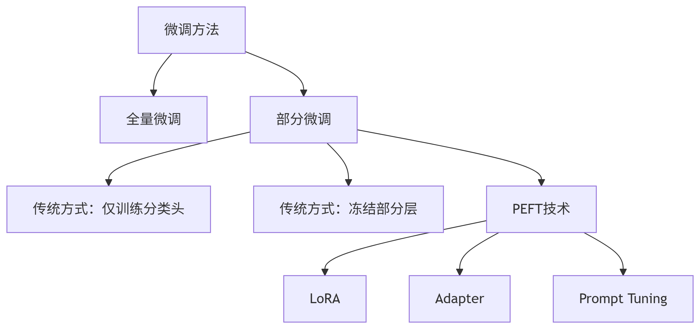

全量微调 

gpt2

peft  参数高效部分微调

adapter

lora

chatglm

prompt微调

​	prefix

​	ptuning

​	pet  bert+prompt

回顾四个范式

传统机器学习模型

tf-idf+朴素贝叶斯的机器学习方法

深度学习模型

word2vec+lstm 无需传统特征工程

bert预训练模型

迁移学习 fine-tuning中的部分微调  添加自己的模型输出层  主义区别adapter微调，同样都是添加可训练模块，冻结模型，**而 Adapter 是在模型内部插入小型可训练模块，属于 PEFT**

进行部分微调和 全量微调  

预训练模型+prompt+预测的方式（少监督无监督的方向）

预训练模型：全量微调和参数高效微调。大模型几乎没有不是peft的部分微调，即仅仅训练部分层。

🔹 **Adapter是PEFT** → 通过**深层表征干预**实现高效适应
🔹 **BERT+线性层不是PEFT** → 仅是**表层决策映射**

peft的准则是 冻结原始权重，注入模块高效微调来提取表征。

参数高效性	训练参数量 << 原始模型参数量（通常<10%）

表征干预性 **在特征提取过程中动态调整深层表示**（而不仅是末端映射）

**BitFit是完全符合PEFT定义的方法**：
✅ 严格冻结原始权重
✅ 通过微调固有bias项实现深层表征调整，利用模型固有结构实现高效适应。

将部分微调的思想创新在peft领域。

微调方法 **Fine Tuning**

**1. 全量微调（Full Fine-Tuning）**

- **定义**：更新预训练模型的所有参数。
- **特点**：
  - 需要大量计算资源和显存（适合GPU充足场景）。
  - 可能面临灾难性遗忘（Catastrophic Forgetting），即模型忘记预训练学到的通用知识。
  - 通常在小规模领域数据上效果最优（但可能过拟合）。
- **适用场景**：数据量充足、计算资源丰富，且任务与预训练任务差异较大时。

2.**部分微调（Partial Fine-Tuning）**

- **广义定义**：**仅更新模型中的部分参数**（而非全部参数）的微调策略。
- **常见实现方式**：
  - 仅仅训练添加的线性层，经典迁移学习。  bert时代常用
  - 冻结（Freeze）部分网络层（如仅微调最后3层）   bert时代常用
  - 选择性训练特定类型参数（如仅训练偏置项）  到了llm时代属于peft的一种
  - **PEFT 方法**（如LoRA、Adapter等）

**2. 参数高效微调（Parameter-Efficient Fine-Tuning, PEFT）**

这类方法**只更新少量参数**，属于Fine Tuning的子集，但**不包括全量微调**。常见技术：

- **Adapter**：在Transformer层插入小型网络模块，仅训练这些模块。
- **LoRA（Low-Rank Adaptation）**：通过低秩矩阵分解，在权重更新时注入可训练的低秩矩阵。
- **Prefix-Tuning/Prompt Tuning**：在输入侧添加可学习的软提示（Soft Prompts）。
- **BitFit**：仅训练模型中的偏置（Bias）参数。
- **QLoRA**：量化+LoRA，进一步降低显存需求。

pet  模板引导的训练

属于全量微调，也属于prompt-tuning。并没有训练提示词向量，而是训练bert的参数，更像是提示工程，提示词以向量的形式加入bert中。类似于bert的预训练任务来输出结果。

具体做法：

1. 构建模板：构建一个硬模板，让模型预测mask的词。例如 [CLS] i  like  the disney film very much [SEP] it was [MASK] . [SEP]。
2. 构建词映射表，将预测词语映射到我们的分类中。
3. 训练bert模型

思想：

1.复用bert预训练好的MLM分类器，得到[MASK]的概率分布。

2.因为[MASK]对部分词感兴趣，超过我们的类目，所以要将预测词映射到我们的分类中

3.根据verbalizer，可以获得labelword的预测概率分布，使用交叉信息熵进行训练。此时支队MLMhead进行微调，所以避免了过拟合问题。不改变语义表征，只改变映射方向。当然也可以训练整个bert。

整体思想：

使用硬的模板   微调整个模型，可以理解为提示工程的全量微调或部分微调（只训练mlm）。

in context learning  提示学习，只需要样例

instruction  tuning   指令微调  数据设计的方法：做选择题的能力，设计指令让模型学习，激发模型理解能力。

chain of thought

2021  prefix tuning  在输入或隐藏层前加入k个可训练的token。针对不同的任务用不同的前缀，每一层都有，加在最前面模仿指令学习。

2019 adapter  将可训练的模块加入隐层的每一层 

lora 通过学习小的低秩矩阵来近似训练模型参数。A矩阵正态分布，B矩阵全零矩阵

微调 CHATGPT：

dataset  dataloader  model  train

文本要处理成什么样的，文本和标签是怎样的，我猜测是 bopA   ABsop    bopAB  ABCsop  这样的。因为每次只预测一个词。标签比输入多一个词。

 

