AIGC

之前做了都是nlp相关的，主要使用bert，大模型这些模型

做了 文本分类 ，实体识别 这些任务  使用文本理解，文本生成

大模型在图像生成 ，语音生成，视频生成有更大的发展前景。

什么是AIGC
AIGC(Artificial Intelligence Generative Content)，人工智能生成内容。

应用场景：autoglm，
    内容孪生（工程化对齐）：内容转译，内容增强
    内容编辑（单次对齐）：场景剪辑，人声分离，虚拟试衣
    内容生成：图片生成（midd，dalle-e，一格），视频生成（），音频生成

aigc的产品形态
    1. 预训练模型   大算力+大量通用数据
    2. 中间层：垂直化，场景化，个性化模型
    3. 应用层：文字，语音，图像智能体实现用户需求

图像生成算法：
    变分自编码器（VAE）
    生成对抗网络
        GANzoo Bertzoo
    扩散模型（目前主流）
        扩散步骤的马尔科夫列，训练是去噪声

  

VAE

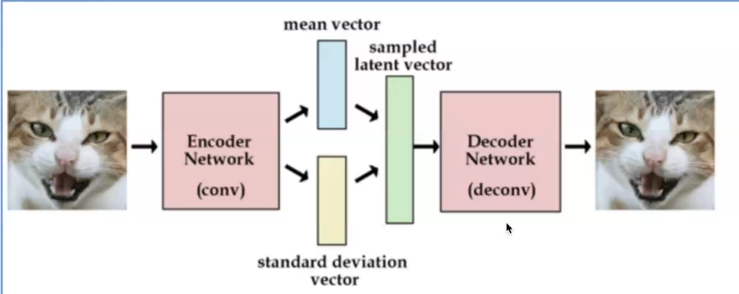

​        

1.用conv作为encoder，提取图像的特征（概率分布）。

meanvector standard vector获得潜空间特征。

从潜空间通过反卷积cnn解码器生成图片。

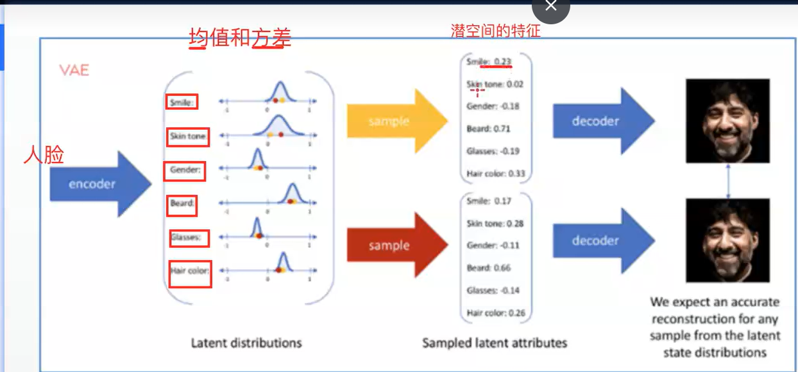

2.对抗生成网络

生成器和判别器

生成器根据向量生成图片（ 反cnn）

判别器判断图像是真实还是生成器生成。 

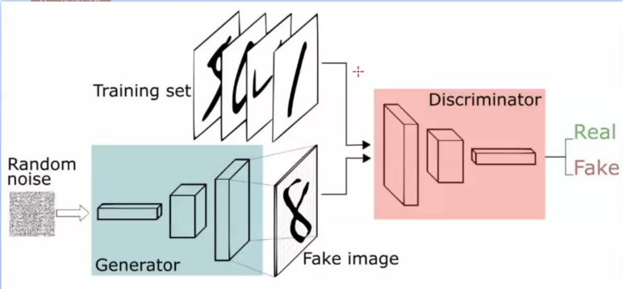

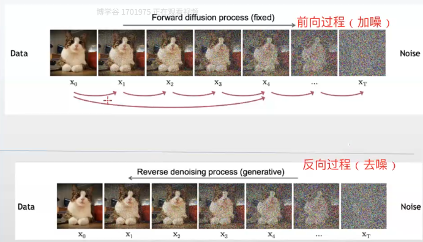

思想：本身设计是为了去噪，给清水加墨水。定义马尔可夫链

步骤：

前向过程：加正态分布的噪声  得到正太分布的噪声数据

反向过程：反向减去噪声获得清洗的图像。

clip的发布  2021

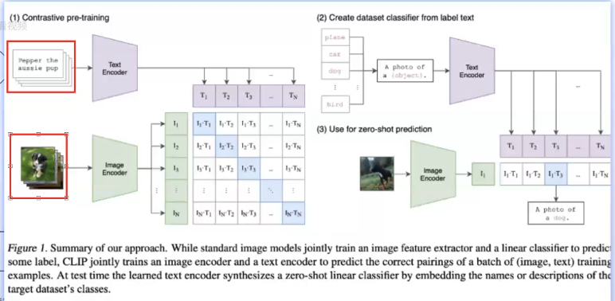

目标是做文图匹配的大模型。

采用双塔模型和对比学习的方法。用图文对训练。

dall-e

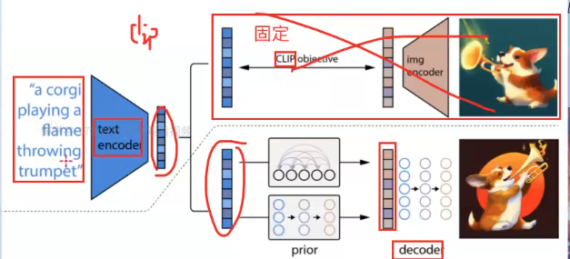

imagen

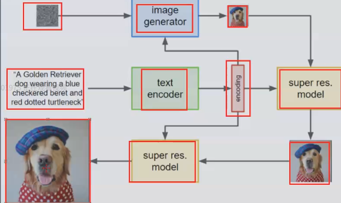

stable diffusion

简介：开源图像生成模型。扩散模型使用潜在扩散模型。

原理：在潜空间去噪和加噪能有效减少资源消耗。

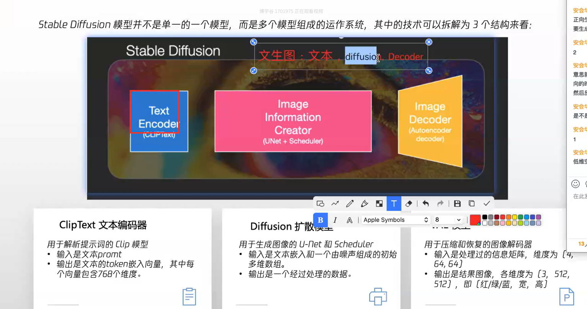

处理流程

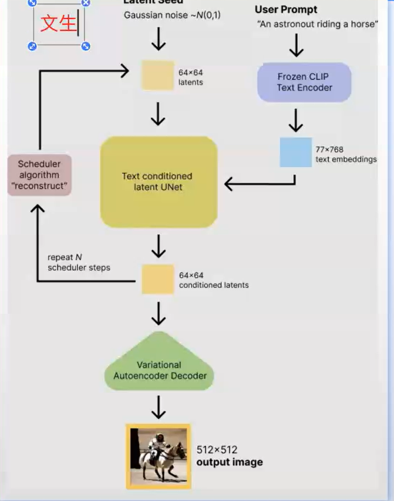

应用

实战

平台 高性能应用服务Hai

创建示例

lora微调

预测

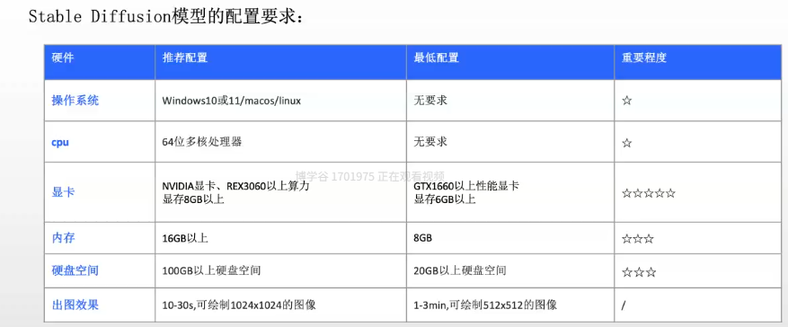

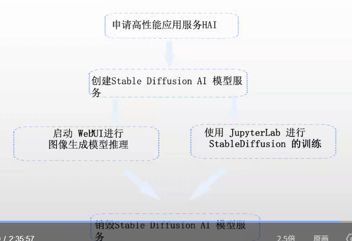

腾讯云 高性能应用服务hai 更易用的GPU智算服务
