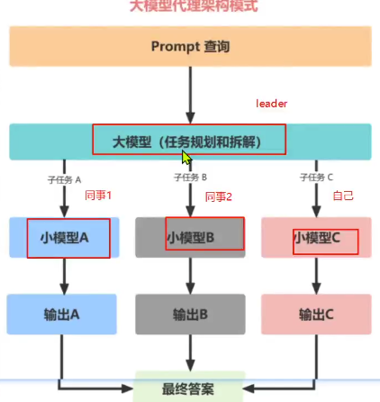

理论知识：

数学

深度学习

工程能力

编程语言：

C++：

cuda开发：优化训练和推理代码。

python：

numpy，pandas

数据分析和数据处理工具

scikit-learn，pytorch

神经网络模型训练

模型微调：

peft ，lammafactory，ms-swift：

大模型开发：

langchain

模型部署：

vllm

## 大模型架构

大模型代理架构模式

