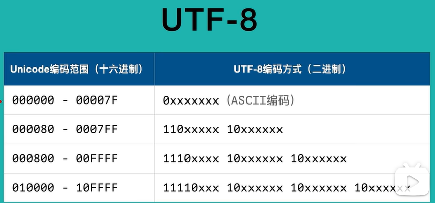

## 搭建python环境

#### 一、下载与安装python

​	python解释器： 在官网下载 ，安装，配置环境变量，在cmd验证。

​	anaconda：环境管理工具（自带python解释器，本质上多了环境管理的功能）官网下载，安装，配置环境变量，验证。

#### 二、运行python程序：

1.交互式解释器编程：python

2.命令行执行脚本      python script.py文件   python --version -V

3.pycharm，vscode集成开发环境（方便开发与调试）


## python基本语法

#### xxxxxxxxxx # torch.Tensor()指定数据或形状创建张量，指定数据的时候一定有方括号，包括列表和ndarray数组。import numpy as npnnn=np.random.randn(2,3)ttt=torch.tensor(nnn)print(ttt)x=torch.Tensor(2,3)x=torch.Tensor(nnn)print(x)y=torch.IntTensor([10])z=torch.FloatTensor([11,12])u=torch.DoubleTensor([11,12,13])python

```python
"""
\u4f60 是字符的 Unicode 代码点（4位十六进制数）
\xe4\xbd\xa0 是同一个字符的 UTF-8 编码表示（3字节）
这就是为什么同一个汉字会有不同的字节表示方式。Unicode 是字符集（定义了字符和码点的对应关系），而 UTF-8 是编码方案（定义了如何在计算机中存储这些字符）。"""
string="\x41\u0041hello你好\U00000394\u4f60\u597d"
print(string)
bytes_data=string.encode()  #将字符串编码为字节串
print(bytes_data)
string_new=bytes_data.decode() # 将字节串解码为字符串
print(string_new)
```

python脚本文件以UTF-8编码，所有字符串都是unicode字符集字符组成的字符串。

用utf-8编码脚本保存在计算机；

python操作时用unicode。

1. Unicode 是字符集标准，定义了字符和代码点的对应关系
2. UTF-8 是编码方案，定义了如何将码点转换为字节序列
3. Python 3 内部映射Unicode代码点和字符，传输时用utf-8编码方案

**字符串（string）：**
字符串是由Unicode字符组成的序列。在Python中，字符串用于处理文本数据，可以包含各种字符，包括字母、数字、符号等。字符串也是不可变的。

**字节串（bytes）：**
字节串是由0-255范围内的整数构成的序列，用于在程序中处理8位字节数据。字节串通常用于处理二进制数据，如文件、网络数据等。字节串是不可变的，这意味着一旦创建了一个字节串，就不能修改它。


ascii 0-127 0-255 字符和数字的映射关系。每个字符占一个字节。

Unicode 由Unicode字符集和多套编码规则共同组成：

给每一个字符分配一个数字作为代码点  字素可能由多个代码点组成



#### 二、python标识符和关键字

标识符用于变量名，函数名，类名的**命名**

1.由数字，字母，下划线组成。

2.不能以数字开头。不能是关键字

3.汉字也能用，但是不推荐

4.关键字如下

运算符号，常量，程序控制语句

```python
import keyword
print(keyword.kwlist)
'''
['False', 'None', 'True', 'and', 'as', 'assert', 'async', 'await', 'break', 'class', 'continue', 'def', 'del', 'elif', 'else', 'except', 'finally', 'for', 'from', 'global', 'if', 'import', 'in', 'is', 'lambda', 'nonlocal', 'not', 'or', 'pass', 'raise', 'return', 'try', 'while', 'with', 'yield']
'''
help("keywords")
```

#### 三、缩进与换行

1.python使用**回车**来代替分号。一行一条独立的语句。

2.python使用**缩进**来表示{}，相同缩进代表同一个代码块 。缩进的空格数是可变的，同一个代码块缩进要统一。

3.python通常用一行写完，如果语句比较长，可以使用\放在句尾来实现多行语句。

在[],{},()中的多行语句不需要使用反斜杠。注意不包括"""\n"""

#### 四、注释

1.单行注释使用#号

2.多行注释使用三引号''' """

