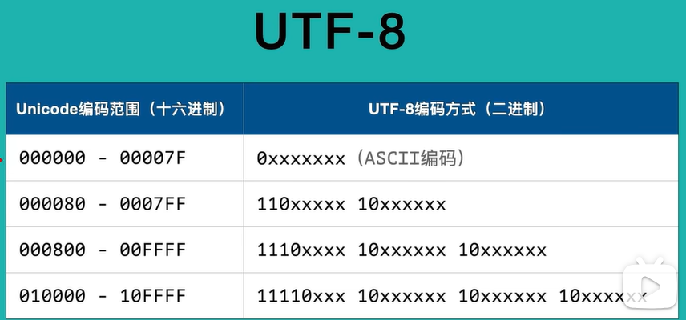

## 搭建python环境

#### 一、下载与安装python

- ​	python解释器： 在官网**下载**安装包，**安装**python，**配置环境****变量**，在cmd验证输入python**验证**。

- ​	anaconda：官网**下载**，**安装**，**配置环境变量**（可在conda prompt直接验证），**验证**。anaconda自带一个包括python和多种科学计算，数据处理包的环境，还带有conda环境管理工具。

#### 二、运行python程序

- 在**命令行执行脚本**      python script.py文件   python --version -V
- 在**集成开发工具**（pycharm，vscode）执行脚本（方便开发与调试）


## python基本语法

#### 一、Unicode和UTF-8编码以及字节串和字符串

- **Unicode**是一个**字符集标准**，它几乎为所有文字系统中的**字符**分配了**唯一数字标识**（称为码点或code point）。

- **UTF-8** 是 Unicode 的一种实现方式，它规定了如何将 **Unicode 码点**转换为**字节序列**以便存储和传输。以下是编码规则。

  - UTF-8 是一种**可变长度编码**：

    - ASCII 字符（0-127）用 1 个字节表示

    - 大部分欧洲语言字符用 2 个字节表示

    - 中文、日文等亚洲文字通常用 3 个字节表示

    - 其他罕见字符可能需要 4 个字节

  - 编码点**如何转化**为utf-8编码 

    - 根据编码坐落的数值范围（U+4E2D 用十六进制表示为 4E2D，转换为二进制：0100 1110 0010 1101）

    - 选择对应模板(因为 4E2D 大于 0800 且小于 FFFF，所以需要 3 个字节编码,3 字节 UTF-8 模板：1110xxxx 10xxxxxx 10xxxxxx)

    - 填充二进制位，得到UTF-8编码(11100100 10100010 10101101)	

  - 

  - unicode兼容ascii码

  - **ascii** 0-127  字符和数字的映射关系。每个字符占一个字节。

    ​	Unicode 由Unicode字符集和多套编码规则共同组成：

    ​	给每一个字符分配一个数字作为代码点  字素可能由多个代码点组成

- python和Unicode,UTF-8的关系总结

  - Unicode 是字符集标准，定义了字符和代码点的对应关系
  - UTF-8 是编码方案，定义了如何将码点转换为字节序列
  - Python 3 内部映射Unicode代码点和字符（所有字符串(`str`类型)在内部都是 Unicode 表示的），传输时用utf-8编码方案
  - Python **读取或写入文本文件**时，默认使用 UTF-8 编码
  - Python 3 **源文件****保存**默认使用 UTF-8 编码

- **字符串（string）：**

  字符串是由Unicode字符组成的序列。在Python中，字符串用于处理文本数据，可以包含各种字符，包括字母、数字、符号等。字符串也是不可变的。

- **字节串（bytes）：**

  字节串是由0-255范围内的整数构成的序列，用于在程序中处理8位字节数据。字节串通常用于处理二进制数据，如文件、网络数据等。字节串是不可变的，这意味着一旦创建了一个字节串，就不能修改它。

```python
"""
\u4f60 是字符的 Unicode 代码点（4位十六进制数，可转化为16位二进制数，正常占2个字节）
\xe4\xbd\xa0 是同一个字符的 UTF-8 编码表示（将码点模板，转化为24位二进制数，占3字节）
这就是为什么同一个汉字会有不同的字节表示方式。Unicode 是字符集（定义了字符和码点的对应关系），而 UTF-8 是编码方案（定义了如何在计算机中存储这些字符）。"""
string="\x41\u0041hello你好\U00000394\u4f60\u597d"
print(string)
bytes_data=string.encode()  #将字符串编码为字节串
print(bytes_data)
string_new=bytes_data.decode() # 将字节串解码为字符串
print(string_new)
#示例代码中\U00000394是希腊字母Delta(Δ)
#encode()/decode()方法可以指定其他编码方式(如'gbk')
```

#### 二、python标识符和关键字

- **标识符**用于**变量名**，**函数名**，类名的**命名**
  1. 标识符由数字，字母，下划线组成。
  2. 不能以数字开头。不能是关键字
  3. 汉字也能用，但是不推荐

- **关键字**包括一些 运算符号，常量，程序控制语句

```python
import keyword
print(keyword.kwlist)
'''
['False', 'None', 'True', 'and', 'as', 'assert', 'async', 'await', 'break', 'class', 'continue', 'def', 'del', 'elif', 'else', 'except', 'finally', 'for', 'from', 'global', 'if', 'import', 'in', 'is', 'lambda', 'nonlocal', 'not', 'or', 'pass', 'raise', 'return', 'try', 'while', 'with', 'yield']
'''
help("keywords")
```

#### 三、缩进与换行

1. python使用**回车**来代替分号。一行一条独立的语句。
2. python使用**缩进**来替代{}划分代码块，相同缩进代表同一个代码块 。缩进的空格数是可变的，同一个代码块缩进要统一。

3. python通常用一行写完，如果语句比较长，可以使用\放在句尾来实现多行语句。在[],{},()中的多行语句不需要使用反斜杠实现多行。多行字符串也不需要。

#### 四、注释

1. 单行注释使用#号
2. 多行字符串实现多行注释

