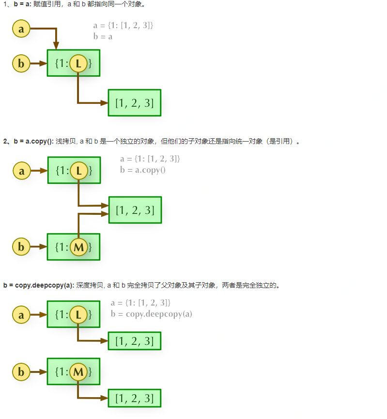

[什么是python交互式解释器 | 酷python (coolpython.net)](http://www.coolpython.net/python_primary/introduction/interpreter.html)

### 数据类型

#### 数据类型介绍

##### 	python中的基本数据类型

​		计算机解决问题时需要处理数据，选择不同的数据类型来抽象信息，能使数据的组织更高效。

​		python中的基本数据类型有：数值型（int，float，complex）,布尔型（bool）,容器类型（字符串，列表，元组，字典，集合）。他们本质上都是类。

##### 	常量

​		python中的常量本质上是对象；

##### 	变量

​        变量是通用指针，必须依附常量才有意义。

​		python中的变量没有固定数据类型，变量的类型由其指向的对象决定。

##### 	type()内置函数和id()内置函数

​		可以用内置函数**type()**来看常量（对象）的数据类型（类），也可以用type()看变量所绑定常量的数据类型；可以用内置函数id()查看常量（对象）的存储空间，也可以用**id()**看变量所指向常量的存储空间。

#### 一、数值型

```python
a=1
b=1.5  # 1.5是浮点型，那么变量类型是什么。
print(type(a)) 
print(type(b))	
#<class 'int'>
#<class 'float'>
```

常量形式：

int：1 （不带小数点的整数）

float：1.1（带小数点的浮点数）

python中所有的值都是对象，（int是整型类，float是浮点型类），所有对象通过type()内置函数来查看其类名。

#### 二、布尔型

```python
c=True
print(type(c))
print(int(c))
print(float(c))
print(bool(0))
print(bool(1))
print(bool(0.0))
print(bool(1.0))
```

bool:True False

#### 容器类型

容器是组织数据的数据类型。

##### 	容器通用函数和操作符

​		len()函数获取容器中元素的个数

| 操作符 | 描述                                               |
| :----: | -------------------------------------------------- |
|   []   | 通过索引访问指定索引的字符（只对有序容器可用）     |
| [ : ]  | 切片操作，截取字符串指定范围（只对有序容器可用）   |
|   in   | 成员运算符 - 如果字符串中包含给定的字符返回 True   |
| not in | 成员运算符 - 如果字符串中不包含给定的字符返回 True |

#### 三、字符串类型(不可变类型，有序，可重复，元素只能是字符串)

​		字符串是字符的序列。字符串类型用来处理文本数据，文本内容包括字符和转义字符，可以中单引号，双引号，三引号包裹。

##### 	字符串创建和使用

```python
# 创建字符串
str_1 = 'python'
str_2 = "python"
str_3 = """python"""
print(str_1, type(str_1))
# 字符串索引和切片（字符串索引）
x=str_1[0]			# 可以使用反向索引
str_new=str_1[0:5:1]   # 【开始索引，结束索引，方向和间隔】切片的结果是浅拷贝，而且可以使用反向遍历

lst = ['book', 'python', 'good']
with open('data', 'w')as f:
    for word in lst:
        f.write(word + "\n")
with open('data', 'r')as f:
    for line in f:
        print(line.strip())
```

##### 	运算符

| 操作符 | 描述       |
| :----: | ---------- |
|   +    | 字符串连接 |
|   *    | 重复字符串 |
|   %    | 格式字符串 |

##### 	字符串方法

| 编号 | 方法名称                                                     | 功能描述                                                     |
| ---- | ------------------------------------------------------------ | ------------------------------------------------------------ |
|      | 转换类方法                                                   |                                                              |
| 1    | [capitalize()](http://www.coolpython.net/method_topic/str/capitalize.html) | 将字符串的第一个字符转换为大写                               |
| 4    | [join(seq)](http://www.coolpython.net/method_topic/str/join.html) | 以指定字符串作为分隔符，将 seq 中所有的元素(的字符串表示)合并为一个新的字符串 |
| 12   | [split(sep=None, maxsplit=-1)](http://www.coolpython.net/method_topic/str/split.html) | 以 sep为分隔符截取字符串，如果 maxsplit 有指定值，则仅截取 maxsplit+1 个子字符串 |
| 12.1 | [strip([chars\])](http://www.coolpython.net/method_topic/str/strip.html) | 在字符串上执行 lstrip()和 rstrip()                           |
| 13   | [replace(old, new[, count\])](http://www.coolpython.net/method_topic/str/replace.html) | 将字符串中的 old 替换成 new,如果 max 指定，则替换不超过 count 次 |
|      | 查询类方法                                                   |                                                              |
| 2    | [find](http://www.coolpython.net/method_topic/str/find.html) | 查找子串sub在字符串中的位置，如果找不到返回-1                |
| 4    | [index](http://www.coolpython.net/method_topic/str/index.html) | 跟find()方法一样，只不过如果sub不在字符串中会报一个异常      |

##### 	转义字符

| 转义字符    | 描述                                         |
| ----------- | -------------------------------------------- |
| \(在行尾时) | 续行符                                       |
| \\          | 反斜杠符号                                   |
| \'          | 单引号                                       |
| \"          | 双引号                                       |
| \a          | 响铃                                         |
| \b          | 退格(Backspace)                              |
| \e          | 转义                                         |
| \000        | 空                                           |
| \n          | 换行                                         |
| \v          | 纵向制表符                                   |
| \t          | 横向制表符                                   |
| \r          | 回车                                         |
| \f          | 换页                                         |
| \oyy        | 八进制数，yy代表的字符，例如：\o12代表换行   |
| \xyy        | 十六进制数，yy代表的字符，例如：\x0a代表换行 |
| \other      | 其它的字符以普通格式输出                     |

##### 	字符串格式化

######  % 格式化字符串

```python
s='我喜欢 %s 色' % '红'
```

######  format

```python
string = "{course}考了90分,{name}非常高兴" string = string.format(course="语文", name="李雷") print(string)
```

######  f-string

```python
f-string 是python3.6加入的一种新技术，这种技术称之为字面量格式化字符串。

info = {'languge': 'python', 'site': 'http://www.coolpython.net'} print(f"我正在学习{info['languge']}, 使用的教程网址是{info['site']}"
```

#### 四、列表（可变类型，有序，可重复，元素类型不限）

##### 	创建列表

```python
lst = [1, '2', True, [1, 2]]

lst1 = list("python")  # 用可迭代对象创建
```

##### 	访问列表

```python
lst = [2, 3, 5, 6]

print(lst[3])       *# 6* 

print(lst[-1])      *# 6*
```

​	增加元素

```python
lst = [1, 2, 3]
lst.append(4)
print(lst)          # [1, 2, 3, 4]
lst = [1, 2, 3]
lst.insert(0, 4)
print(lst)      # [4, 1, 2, 3]
lst1 = [1, 2, 3]
lst2 = [4, 5, 6]

lst1.extend(lst2)
print(lst1)         # [1, 2, 3, 4, 5, 6]
```

​	删除元素

```
lst = [1, 2, 3, 2]
lst.remove(2)       # 明确指明要删除2
print(lst)          # [1, 3, 2]

lst = [1, 2, 3, 2]
lst.pop(2)       # 指明要删除索引为2的元素
print(lst)          # [1, 2, 2]

lst = [1, 2, 3, 2]
del lst[2]
print(lst)    # [1, 2, 2]

lst = [1, 2, 3, 2]
lst.clear()
print(lst)      # []
```


### 数据类型转换

### 字面量

### 变量


