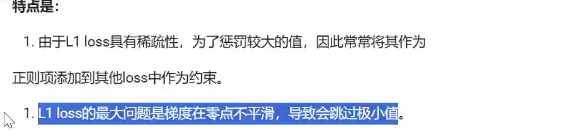

神经网络的介绍


神经元：输入和权重的乘积求和（加权和）加上非线性激活函数，意味着线、面、超平面向曲线，曲面、超曲面的转化。


神经网络就是神经元的堆叠。

神经网络的一般结构。输入层+隐藏层+输出层

输入层：输入数据

隐藏层：提取特征，图中提取了两次特征。

输出层：输出最终结果

特点是：

同一层的神经元之间是没有连接的。

第N层的每个神经元和第N-1层的所有神经元相连（full connected 全连接）。

第N-1层的输出就是第N层的输入。

每个连接都有一个w权重


激活函数：

激活函数用于对每层的输出数据进行变换，进而为整个网络注入了非线性因素。此时可以拟合各种曲线曲面。

不引入非线性，神经元的堆叠没有意义。线性组合的线性运算可以话简成一个线性组合。

引入非线性，可以通过神经元的堆叠逼近任意函数，提升网络对复杂问题，的拟合能力。


sigmoid：


f(x)=1/(1+e-x)    f`(x)=f(x)(1-f(x))


tanh()


ReLU激活函数


1.relu死区问题，神经元的死亡问题，线性组合的结果如果小于零，那么神经元死亡。

2.计算量小。

3.一旦一个神经元的输出为零，它在反向传播中接收到的梯度也是零。


结果由同一层相互作用。


使用时

隐藏层优先用relu，可以尝试leakyrelu

避免大量神经元死亡的情况

少用sigmoid激活函数，可以尝试tanh激活函数


输出层

二分类用sigmoid

多分类用softmax

回归问题用identity


初始化方法：

均匀，正态，凯明，哈维


损失函数：

```
# 损失函数描述模型输出和真实值的差异
```

多分类交叉熵损失


二分类损失


MAE损失




L2 MSE损失


smoothL1


优化方法


# Momentum
# 用指数加权平均法来更新梯度


adagrad


