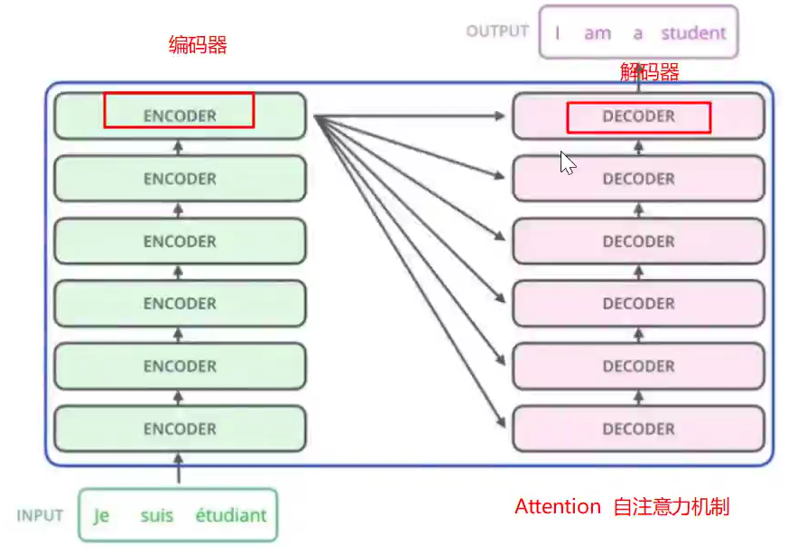
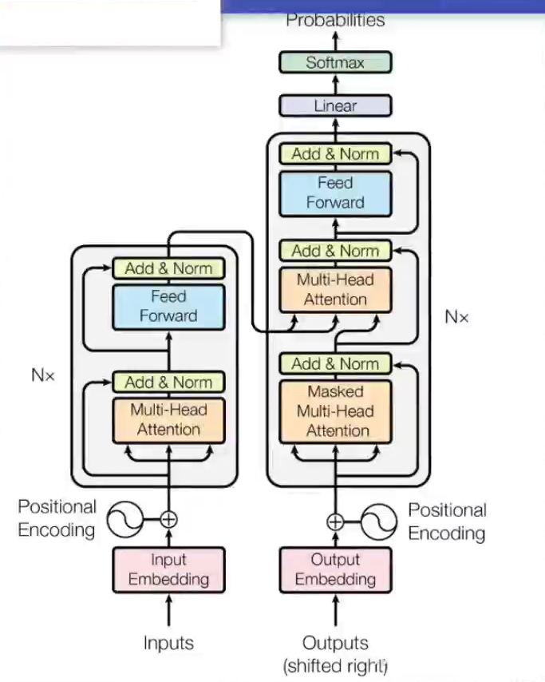
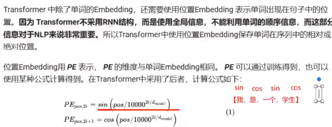
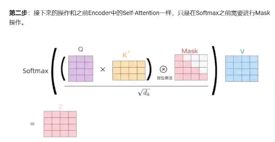

Transormer

Transformer 是一种基于[自注意力机制](https://so.csdn.net/so/search?q=自注意力机制&spm=1001.2101.3001.7020)（Self-Attention）的神经网络架构，由 Vaswani 等人在 2017 年提出。它在自然语言处理（NLP）任务中表现出色，尤其是在机器翻译领域。

### transformer的结构

Transformer 的核心组件包括：

编码器（Encoder）：将输入序列（如中文句子）转换为一系列隐藏表示。

解码器（Decoder）：基于编码器的输出和已生成的目标序列（如英文句子）生成下一个词。

自注意力机制（Self-Attention）：捕捉序列中每个词与其他词的关系。

位置编码（Positional Encoding）：为模型提供序列中词的位置信息。2. Transformer 的优势

1.词向量embedding+位置embedding得到词向量矩阵

2.词向量编码矩阵输入编码器，得到编码矩阵

3.输出的编码矩阵进入解码器配合带掩码的预测序列编码矩阵输出下一个词的预测。

多头注意力机制

softmax（QKT/d）V

### Transformer的优势

- **并行计算**：与 RNN 不同，Transformer 可以并行处理整个序列，训练速度更快。
- **长距离依赖**：自注意力机制能够更好地捕捉长距离依赖关系。
- **可扩展性**：Transformer 可以通过堆叠更多的层来提升性能。

我自己的封死也就一千，或者说无法说清楚自己是谁的人。