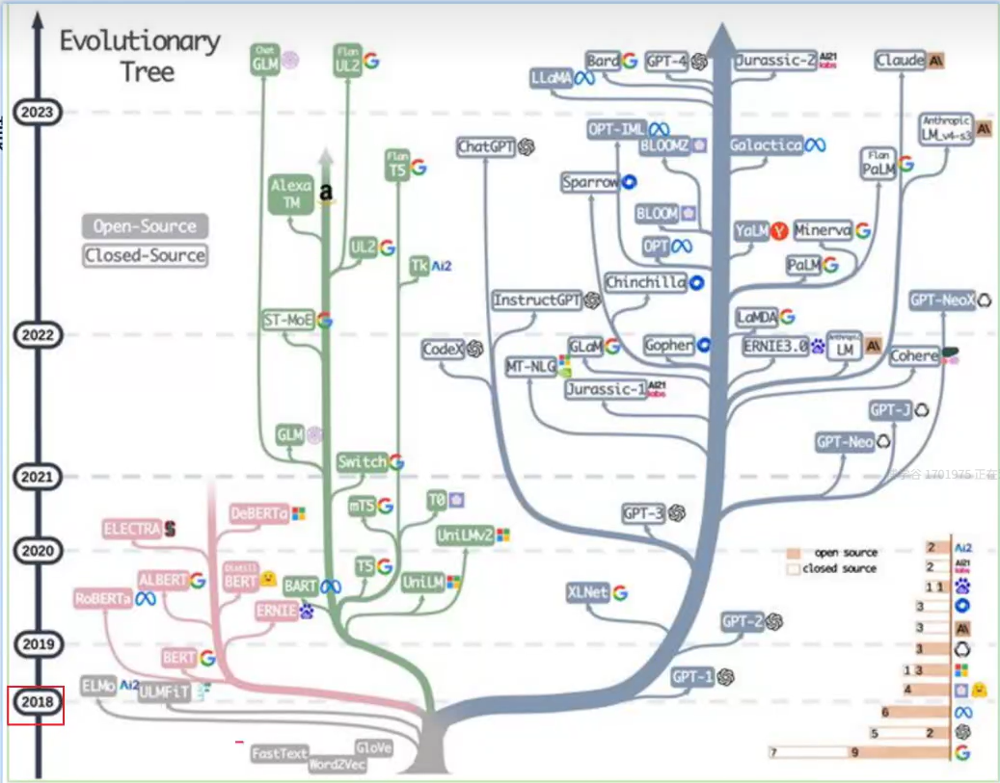
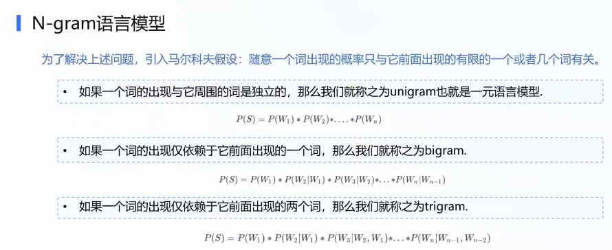
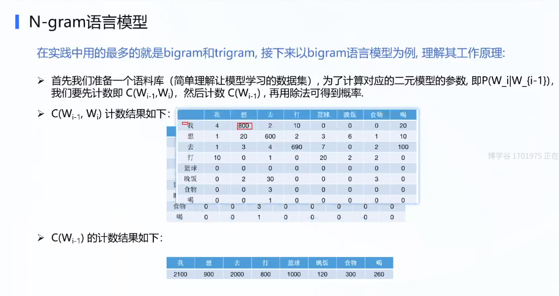
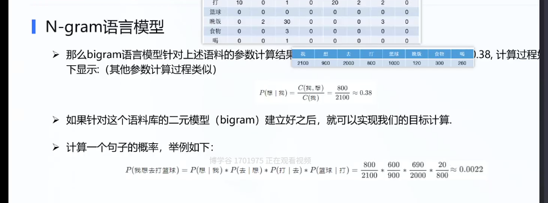

## 大模型

大语言模型原理：

语言模型，

大语言模型    ae  ar  seq2seq

提示词应用

微调方法:基于提示词 lora  全量微调

企业级定制平台

阿里 星辰 千帆

大预言模型应用

rag agent

大模型语言模型算法

全量微调gpt lora 微调chatglm 提示词微调 tongyiqianwen的加速案例

多模态大模型

闻声图大模型

### 背景知识介绍

#### 大语言模型背景

ae autoencoder encoder:Bert  文本理解 nlu比较厉害  Robert  ernie早期版本

encoder-decoder:seq2seq  bart（meta） T5（G） chatglm第一代

decoder:GPT-1 instructGPT  

​						ernie3.0  

​						llama llama3.1

​						gpt

大预言模型旨在理解和生成人类语言，大语言模型可以处理多种自然语言任务，如文本分类，问答，翻译，对话等等。参数大，数据量大。

2017 ：

bert Xlnet gpt

自监督训练目标 MLM淹没语言模型 NSP下一个句子预测

transformer

pretraining  fine-tuning

扩大参数和语料。

bart，T5，gpt3

大模型规模步入千万亿，架构师自回归架构，大模型走向对话式，生成式，多模态时代。

rlhf强化学习

instructiongpt chatgpt bard gpt4

#### 语言模型介绍

判断一段文本是不是人话的模型。

计算一个句子的概率的模型。建模词汇序列的生成概率，提升机器语言智能水平，模拟人类说话，文本输出。

对某个句子序列，模型计算该序列繁盛的概率，如果复合语言习惯，则给出高概率，否子给出低概率。

P(w1)P(W2|W1)

隐藏马尔可夫 rnn bert gpt

基于规则和统计的  hmm crf

神经语言模型 rnn lstm gru

预训练 bert  xlnet T5

gpt enrne 

基于规则和统计的语言模型

人工设计特折 使用统计方法对固定长度的文本窗口序列进行建模分析，ngram。

缺点 条件概率可能性太多，无法估算，不一定有用。参数空间大。

许多此对组合没出现意味着概率为0

引入马尔可夫假设，一个词出现的概率仅仅与前n个词有关。

#### 语言模型评估指标

