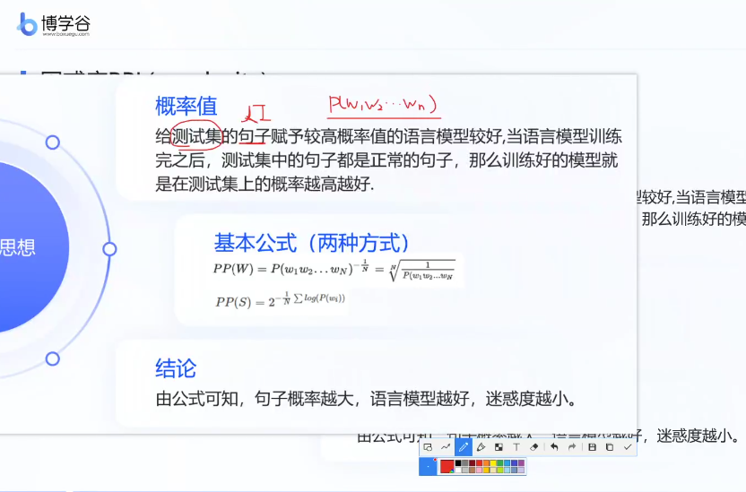
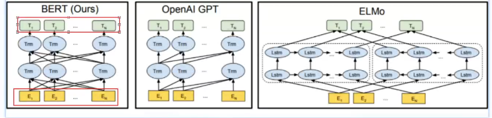
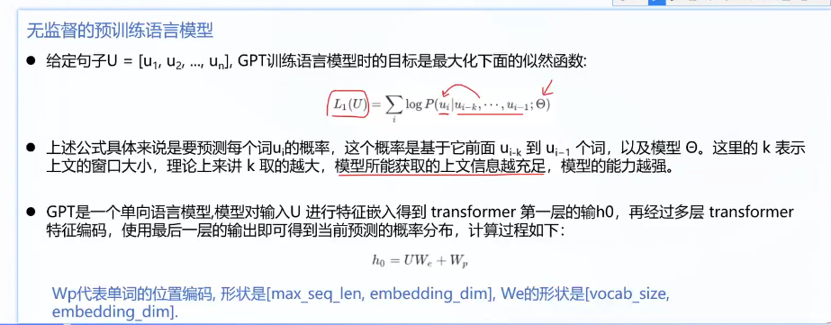
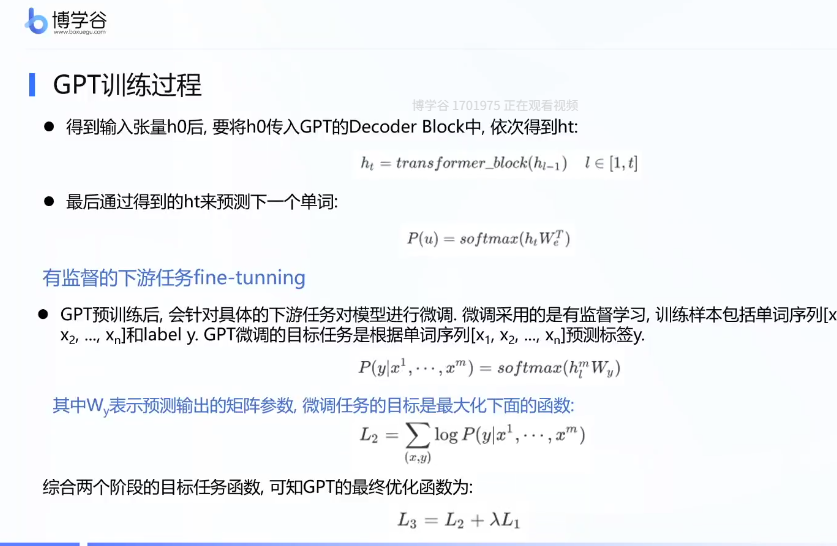
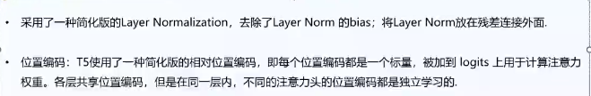

## 大模型

大语言模型原理：

语言模型，

大语言模型    ae  ar  seq2seq

提示词应用

微调方法:基于提示词 lora  全量微调

企业级定制平台

阿里 星辰 千帆

大预言模型应用

rag agent

大模型语言模型算法

全量微调gpt lora 微调chatglm 提示词微调 tongyiqianwen的加速案例

多模态大模型

闻声图大模型

### 背景知识介绍

#### 大语言模型背景

ae autoencoder encoder:Bert  文本理解 nlu比较厉害  Robert  ernie早期版本

encoder-decoder:seq2seq  bart（meta） T5（G） chatglm第一代

decoder:GPT-1 instructGPT  

​						ernie3.0  

​						llama llama3.1

​						gpt

大预言模型旨在理解和生成人类语言，大语言模型可以处理多种自然语言任务，如文本分类，问答，翻译，对话等等。参数大，数据量大。

2017 ：

bert Xlnet gpt

自监督训练目标 MLM淹没语言模型 NSP下一个句子预测

transformer

pretraining  fine-tuning

扩大参数和语料。

bart，T5，gpt3

参数不一样，训练方式不一样。

大模型规模步入千万亿，架构师自回归架构，大模型走向对话式，生成式，多模态时代。

rlhf强化学习

instructiongpt chatgpt bard gpt4

#### 语言模型介绍

判断一段文本是不是人话的模型。

计算一个句子的概率的模型。建模词汇序列的生成概率，提升机器语言智能水平，模拟人类说话，文本输出。

对某个句子序列，模型计算该序列繁盛的概率，如果复合语言习惯，则给出高概率，否子给出低概率。

P(w1)P(W2|W1)

隐藏马尔可夫 rnn bert gpt

基于规则和统计的  hmm crf

神经语言模型 rnn lstm gru

预训练 bert  xlnet T5

gpt enrne 

基于规则和统计的语言模型

人工设计特折 使用统计方法对固定长度的文本窗口序列进行建模分析，ngram。

缺点 条件概率可能性太多，无法估算，不一定有用。参数空间大。

许多此对组合没出现意味着概率为0

引入马尔可夫假设，一个词出现的概率仅仅与前n个词有关。

优点：采用极大似然估计参数一与训练，完全包含了前n-1个词的全部信息，可及时性强

缺点：智能建模到钱n-1个词，随着n的增大参数空间指数增长，数据稀疏难免会出现oov问题，泛化能力差。

基于神经网络：

前n个词的词向量 ，送入rnn，送入线性层softmax，得到概率。

有点：有泛化能力，降低数据系数带来的问题。

缺点：长序列建模能力优先，可能有梯度消失的问题tanh。

基于transformer的预训练语言模型

包括 bert gpt t5 能够从大样本数据中学习大量的与越南表示，并将这些只是运用到下游任务中。

使用方式：

在大规模数据集上事先训练神经网络模型，学到通用的特征只是

微调：在具体的下游任务中使用预训练好的模型进行迁移学习，以获取更好的效果。

特点：

有点：更强大的泛化能力，丰富的语义表示，可以有效防止过拟合。

缺点:计算资源需求大，可解释性差。

大语言模型

随着预训练模型参数的指数级提升，其语言模型性能也会先行上身。

1750亿参数

相较于bert、gpt2、gpt 3 可以在不调整权重的情况下，一句用户给出的任务示例完成具体人土。现在有，mate的llama ，文心一言，glm。

优点：像人类一样只能，具备能与人类沟通的能力，具备使用插件进行自动信息检索的能力。

去点，参数，算力孙连时间，数据量

什么是大预言模型

千亿级参数

主要类被

ngram 神经网络 预训练模型 大预言模型

ngrm 语言模型是什么

bigram trigram

#### 语言模型的效果评估指标

在分类任务中我们一般用以下三个指标。

准确率：预测正确的样本占总样本量的比值。

精确率：在识别为正类别的样本中，是正类别的比例。

召回率：在所有正类别样本中，被正确识别正类别的比例。

在

bleu分数是在评估一种语言翻译成另一种语言的文本质量的指标。将质量的好坏定义为与人类翻译结果的一致性程度。取值范围是【0，1】，

匹配的ngram个数比上翻译中ngram的个数。

考虑的顺序有限，如果有重复值，那么用参考文本的该值个数修正。

rouge

将模型生成的摘要或回答与参考答案进行比较计算，得到对应的得分。

基于召回率，以参考文本作为分母

- 机器翻译用 **BLEU**（避免生成错误内容更重要）
- 文本摘要用 **ROUGE**（覆盖关键信息更重要）
- 研究论文通常**同时报告两者**以获得全面评估

ppl

度量一个概率分布或概率模型预测样本的好坏程度。ppl越小，说明模型越好。

### 大语言模型的主要类别架构

LLM主要类别

LLM基于transformer架构，衍生出了一系列模型，一些模型仅仅使用encoder（自编码模型）或decoder（自回归模型），还有同时使用encoder和decoder（序列到序列模型）。

自编码模型 Autoencoder

代表模型bert，Encoder-Only

预训练方法：

MLM 在输入中随机MASK掉一部分单词，根据上下文预测这个词。

通常用于内容理解任务NLU，情感分析，分类，特征提取。

训练时能获取上下文信息，是双向编码模型。

input 

token embedding 

segment embedding 划分的编码，表示几个句子，NSP（判断是不是上下文的预训练方法）需要。

position embedding transformer无法获取未知性息，位置

12层 768维度  12头  1.15亿个参数  0.11B

自回归模型 

GPT 从左向右学习的模型，智能利用上文或下文的信息。

通常用于生成时任务，在长文本的生成能力很强。

训练方式

无监督的预训练语言模型

有监督的下游任务fine-tunning

12 768 12头 1.17亿个参数

序列到序列模型

T5 将每个task是做序列到序列的转换和生成（文本到文本、图像到图像的多模态任务），将所有nlp任务都视为文本转换任务。

将所有任务转化成文本生成任务。影响了以后的decoder模型。

24 768 12  2.2亿

大模型主流架构-Decoder-only

训练效率和工程师先有优势，理论上是因为encoder的栓像注意力会存在低秩问题，削弱模型表达能力，就生产任务，引入双向注意力并无是指好吃。

在同等参数量，同等推理成本下，decoderonly是最优秀的选择了。

