## 大模型

大语言模型原理：

语言模型，

大语言模型    ae  ar  seq2seq

提示词应用

微调方法:基于提示词 lora  全量微调

企业级定制平台

阿里 星辰 千帆

大预言模型应用

rag agent

大模型语言模型算法

全量微调gpt lora 微调chatglm 提示词微调 tongyiqianwen的加速案例

多模态大模型

闻声图大模型

### 背景知识介绍

#### 大语言模型背景

ae autoencoder encoder:Bert  文本理解 nlu比较厉害  Robert  ernie早期版本

encoder-decoder:seq2seq  bart（meta） T5（G） chatglm第一代

decoder:GPT-1 instructGPT  

​						ernie3.0  

​						llama llama3.1

​						gpt

大预言模型旨在理解和生成人类语言，大语言模型可以处理多种自然语言任务，如文本分类，问答，翻译，对话等等。参数大，数据量大。

2017 ：

bert Xlnet gpt

自监督训练目标 MLM淹没语言模型 NSP下一个句子预测

transformer

pretraining  fine-tuning

扩大参数和语料。

bart，T5，gpt3

参数不一样，训练方式不一样。

大模型规模步入千万亿，架构师自回归架构，大模型走向对话式，生成式，多模态时代。

rlhf强化学习

instructiongpt chatgpt bard gpt4

#### 语言模型介绍

判断一段文本是不是人话的模型。

计算一个句子的概率的模型。建模词汇序列的生成概率，提升机器语言智能水平，模拟人类说话，文本输出。

对某个句子序列，模型计算该序列繁盛的概率，如果复合语言习惯，则给出高概率，否子给出低概率。

P(w1)P(W2|W1)

隐藏马尔可夫 rnn bert gpt

基于规则和统计的  hmm crf

神经语言模型 rnn lstm gru

预训练 bert  xlnet T5

gpt enrne 

基于规则和统计的语言模型

人工设计特折 使用统计方法对固定长度的文本窗口序列进行建模分析，ngram。

缺点 条件概率可能性太多，无法估算，不一定有用。参数空间大。

许多此对组合没出现意味着概率为0

引入马尔可夫假设，一个词出现的概率仅仅与前n个词有关。

优点：采用极大似然估计参数一与训练，完全包含了前n-1个词的全部信息，可及时性强

缺点：智能建模到钱n-1个词，随着n的增大参数空间指数增长，数据稀疏难免会出现oov问题，泛化能力差。

基于神经网络：

前n个词的词向量 ，送入rnn，送入线性层softmax，得到概率。

有点：有泛化能力，降低数据系数带来的问题。

缺点：长序列建模能力优先，可能有梯度消失的问题tanh。

基于transformer的预训练语言模型

包括 bert gpt t5 能够从大样本数据中学习大量的语言表示，并将这些知识运用到下游任务中。

使用方式：

在大规模数据集上事先训练神经网络模型，学到通用的特征知识

微调：在具体的下游任务中使用预训练好的模型进行迁移学习，以获取更好的效果。

特点：

有点：更强大的泛化能力，丰富的语义表示，可以有效防止过拟合。

缺点:计算资源需求大，可解释性差。

大语言模型

随着预训练模型参数的指数级提升，其语言模型性能也会先行上身。

1750亿参数

相较于bert、gpt2、gpt 3 可以在不调整权重的情况下，一句用户给出的任务示例完成具体人土。现在有，mate的llama ，文心一言，glm。

优点：像人类一样智能，具备能与人类沟通的能力，具备使用插件进行自动信息检索的能力。

缺点：巨大的数据量和参数需要的算力或训练时间成本更高。

什么是大预言模型

千亿级参数

主要类被

ngram 神经网络 预训练模型 大预言模型

ngrm 语言模型是什么

bigram trigram

#### 语言模型的效果评估指标

在分类任务中我们一般用以下三个指标。

准确率：预测正确的样本占总样本量的比值。

精确率：在识别为正类别的样本中，是正类别的比例。

召回率：在所有正类别样本中，被正确识别正类别的比例。

在

bleu分数是在评估一种语言翻译成另一种语言的文本质量的指标。将质量的好坏定义为与人类翻译结果的一致性程度。取值范围是【0，1】，

匹配的ngram个数比上翻译中ngram的个数。

考虑的顺序有限，如果有重复值，那么用参考文本的该值个数修正。

rouge

将模型生成的摘要或回答与参考答案进行比较计算，得到对应的得分。

基于召回率，以参考文本作为分母

- 机器翻译用 **BLEU**（避免生成错误内容更重要）
- 文本摘要用 **ROUGE**（覆盖关键信息更重要）
- 研究论文通常**同时报告两者**以获得全面评估

ppl

度量一个概率分布或概率模型预测样本的好坏程度。ppl越小，说明模型越好。

### 大语言模型的主要范式

LLM基于transformer架构，衍生出了一系列模型，一些模型仅仅使用encoder（自编码模型范式）或decoder（自回归模型范式），还有同时使用encoder和decoder（序列到序列模型）。

#### 自编码模型 AutoEncoder

代表模型：bert

架构：Encoder-Only

核心思想：

**双向上下文建模**：模型在预测某个 token 时，可以同时利用该 token **左侧和右侧**的上下文信息（即能看到整个句子）。

预训练方法：

通常通过 **掩码语言建模（Masked Language Modeling, MLM）** 实现。随机遮盖输入文本中的部分 token，让模型根据**未被遮盖的上下文**预测被遮盖的 token。

应用：通常用于内容理解任务NLU，情感分析，分类，特征提取，实体识别。

bert信息

训练时能获取上下文信息，是双向编码模型。

input 

token embedding 

segment embedding 划分的编码，表示几个句子，NSP（判断是不是上下文的预训练方法）需要。

position embedding transformer无法获取未知性息，位置

12层 768维度  12头  1.15亿个参数  0.11B

#### 自回归模型  AutoRegression

架构：Decoder-Only带因果掩码

核心思想：

**单向上下文建模**：模型按**严格从左到右的顺序**生成文本。预测第 `t` 个 token 时，只能依赖 **`1 到 t-1` 的 token**（未来信息不可见）。

预训练方法：

**训练目标**：通过 **标准语言建模（Language Modeling, LM）** 实现。给定前序 token，预测下一个 token（如 `P(x_t | x_<t)`）。

应用：通常用于内容理解任务NLU，情感分析，分类，特征提取，实体识别。

代表模型：bert

GPT 从左向右学习的模型，智能利用上文或下文的信息。

通常用于生成时任务，在长文本的生成能力很强。

训练方式

无监督的预训练语言模型

有监督的下游任务fine-tunning

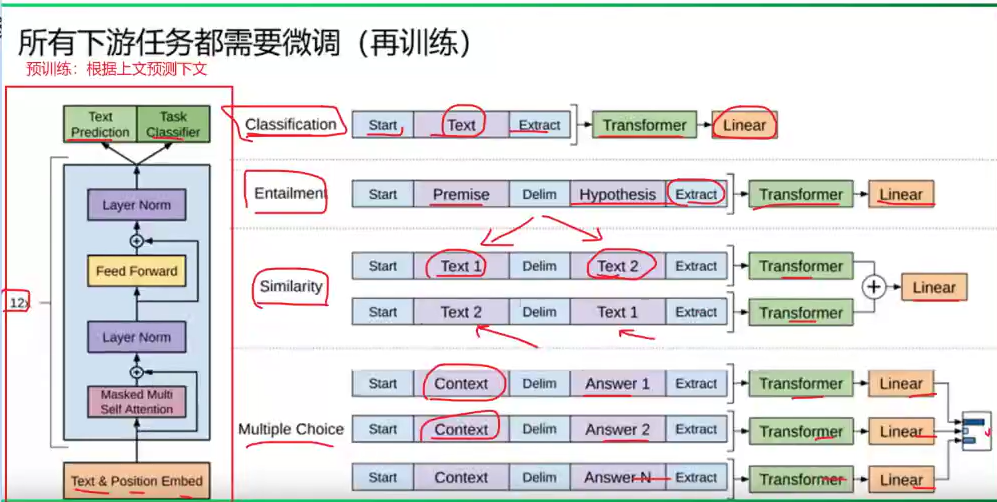

12 768 12头 1.17亿个参数

| 特性           | **AE (AutoEncoding)**      | **AR (AutoRegressive)**      |
| :------------- | :------------------------- | :--------------------------- |
| **上下文方向** | 双向（全句可见）           | 单向（仅历史可见）           |
| **训练目标**   | 掩码预测（MLM）            | 下一词预测（LM）             |
| **典型架构**   | Transformer **Encoder**    | Transformer **Decoder**      |
| **代表模型**   | BERT, RoBERTa              | GPT, LLaMA, PaLM             |
| **擅长任务**   | 文本理解（分类、NER、NLI） | 文本生成（对话、创作、翻译） |
| **生成能力**   | 弱（需额外设计）           | 强（原生支持）               |
| **并行训练**   | ✅ 是                       | ❌ 否（因果掩码限制）         |

#### Encoder-Decoder seq2seq任务的范式

任务 seq2seq

- **定义：** 指的是一类**任务**或**问题**。这类任务的特点是：输入是一个**序列**（比如一句话、一段语音、一个时间序列），输出也是一个**序列**（比如另一句话、一段文本描述、另一个时间序列）。
- **目标：** 学习从**输入序列**到**输出序列**的映射关系。
- **经典例子：**
  - 机器翻译：输入是英语句子序列，输出是法语句子序列。
  - 文本摘要：输入是长文章序列，输出是摘要序列。
  - 语音识别：输入是语音信号序列（帧），输出是文字序列。
  - 对话系统：输入是用户说的话序列，输出是机器回复序列。
  - 代码生成：输入是自然语言描述序列，输出是代码序列。

架构： Encoder-Decoder 条件自回归生成 变体 如最初的 RNN Seq2Seq with Attention, Transformer

**专为“序列转换”设计的特定引擎。专门设计用来处理输入和输出都是序列的问题。Decoder-only 是用“通用生成引擎”来解决了包括 Seq2Seq 在内的各种问题**

提供一种有效的方式，让模型能够处理**变长输入序列**并生成**变长输出序列**，目标是**显式建模输入X到输出Y的条件概率 P(Y|X)**

| 组件        | 对应范式                | 关键特性                                                     |
| :---------- | :---------------------- | :----------------------------------------------------------- |
| **Encoder** | **AE (AutoEncoding)**   | 使用**双向上下文**（能看到整个输入序列），通过类似 MLM 的目标预训练（如 T5 的 Span Corruption，BART 的文本破坏）。负责**理解输入信息**。 |
| **Decoder** | **AR (AutoRegressive)** | 使用**单向上下文**（因果掩码，只能看到历史信息），通过**自回归语言建模（LM）** 训练。负责**生成输出序列**。 |

T5 将每个task是做序列到序列的转换和生成（文本到文本、文本到图像的多模态任务），将所有nlp任务都视为文本转换任务。

将所有任务转化成文本生成任务。影响了以后的decoder模型。

24 768 12  2.2亿

大模型主流架构-Decoder-only

训练效率和工程师先有优势，理论上是因为encoder的栓像注意力会存在低秩问题，削弱模型表达能力，就生产任务，引入双向注意力并无是指好吃。

在同等参数量，同等推理成本下，decoderonly是最优秀的选择了。

### 大模型的实现

#### GPT

什么是ChatGPT

一个聊天机器人模型

##### GPT-1

2018 年发布，起初用于提高模型的语言理解能力。

预训练时：根据上文预测下文，自监督

微调：根据下游任务微调，有监督

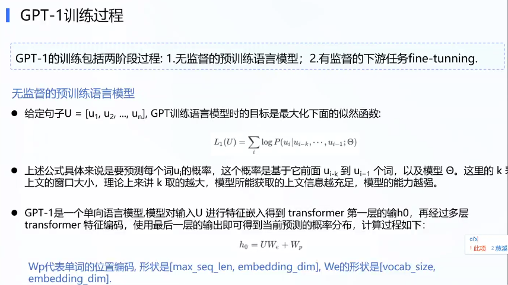

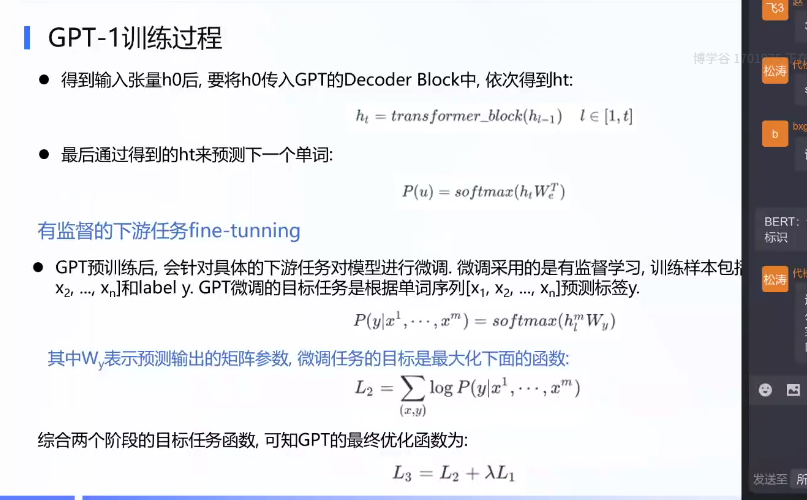

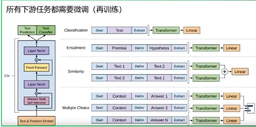

12层 768维度 12头 1.17亿

GPT-1 的“预训练-微调”是两段式流程：

1. **预训练阶段**（OpenAI 完成）：在大量无监督文本上训练通用语言模型（GPT-1 原始权重）。
2. **下游任务微调**（用户完成）：拿到预训练权重后，需针对具体任务（如分类、问答）再训练几小时/几天，添加任务特定层（如分类头），并用少量标注数据微调。

因此，**官方发布的 GPT-1 仅提供预训练权重**，未针对任何下游任务微调。**实际使用时必须二次微调**（除非仅测试其通用生成能力）

##### GPT-2 2019  

48层 1600 12头 15亿  tokens扩大到1024  40G数据量

ln前置到selfatten和ff前面，最后一个block后加了ln

语言模型无监督的多任务学习者

其目标是金采用无监督预训练得到一个泛化能力更浅的语言模型，直接应用到下游任务中。

提出了zeroshot 0样本学习，有了基础的prompt。

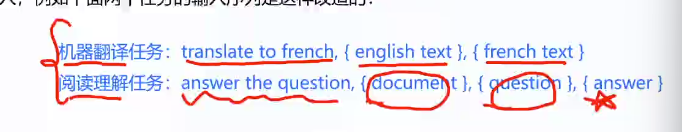

在与训练的时候见过下游任务的自然语言描述示例。只要规定聊天格式就行。

##### gpt3  2020  45TB（570GB）

96 12288 96 1750亿  2048突然太大引入了量化和压缩

引入了稀疏注意力：

denseattention：每个token之间量量计算attention O（n2）

sparse attention :每个token只与其他token的子集计算attention，O(nlogn)

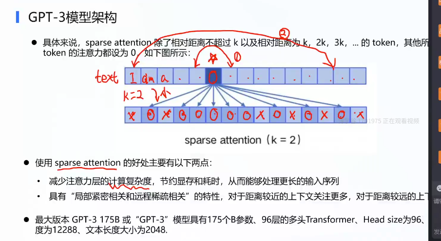

提出了fewshot oneshot zeroshot 使用少量言版本在下游任务让模型给出更准确的答案。

incontext 上下文学习 提示学习

##### GPT3.5 instructGPT ChatGPT 

gpt3.5 可能引入了更高效的注意力机制，使用了更大的规模，更好的训练技术。

instructGPT

RLHF是微调的方法还是预训练：属于微调的方法

为了解决gpt3 模型的不一致问题，使用人类反馈知道学习过程，对其进行了进一步微调，使用的具体技术就是强化学习。

**使用一种称为 RLHF 的训练方法精调出来的模型系列**。

- **核心创新 - RLHF：** 其最大的突破在于训练方法。OpenAI 收集了大量人类标注员提供的“指令-期望输出”示例，并让标注员对不同模型输出的质量进行排序。然后利用这些数据，通过**人类反馈强化学习**来训练模型。
- **目标：** 让模型**更好地遵循人类的指令**，生成更有帮助、更真实、更无害的文本。它显著提升了模型在遵循任务指令方面的能力。

强化学习，用于智能体与环境交互过程中通过学习策略达成回报最大化或实现特定目标。

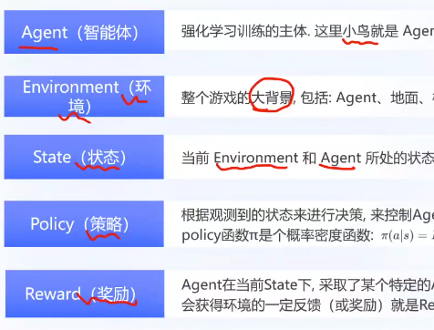

sft微调gpt，构建问题数据集，由gpt给出答案（gpt打标签），之后将问题和答案由人工打分，用问题答案分数训练rm模型，使用rm模型给之后gpt的训练打分。

srt  训练rm  训练llm

chatgpt

依赖于gpt3.5的语言生成能力来进行对话。

- **是什么：** ChatGPT 是 OpenAI **基于 InstructGPT 方法（特别是 RLHF）训练出来的、专门优化用于对话交互的模型产品**。
- **训练方法：** 它**直接继承了 InstructGPT 的核心技术——RLHF**。训练过程同样涉及人类标注员提供对话示例和对模型回复进行排序。
- **优化方向：** 在 RLHF 的基础上，特别针对**多轮对话的上下文理解、连贯性、对话风格（自然、友好）以及安全性**进行了优化。它的训练数据可能更侧重于对话语料。
- **与 GPT-3.5 和 InstructGPT 的关系：**
  - **底层架构：** ChatGPT (最初发布的版本，以及目前广泛使用的免费版本) **基于 GPT-3.5 架构**。
  - **核心技术：** ChatGPT **直接应用并扩展了 InstructGPT 的 RLHF 训练方法**，专门用于对话场景。可以认为 ChatGPT 是 InstructGPT 技术在对话领域的一个成功应用和产品化。
  - **产品形态：** ChatGPT 是面向最终用户的**应用产品**，而 GPT-3.5 和 InstructGPT 更多是指**模型架构和训练技术**。

#### GLM

用了全文预测掩码的方式。

降低了embedding梯度

DeepNorm 的postlayer norm

geglu激活函数

rope

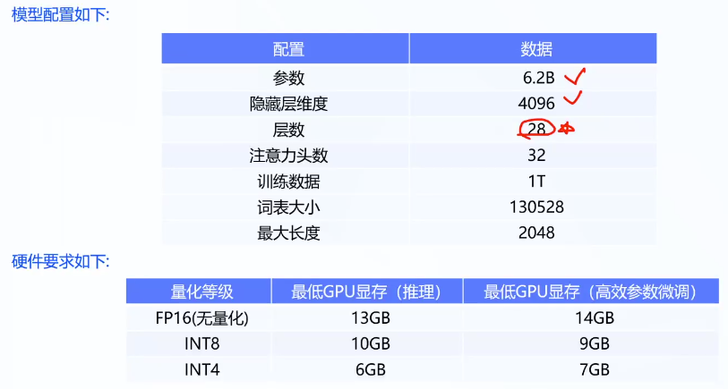

#### llama qwen在lamma上作增量训练

不支持中文

3.1 405B

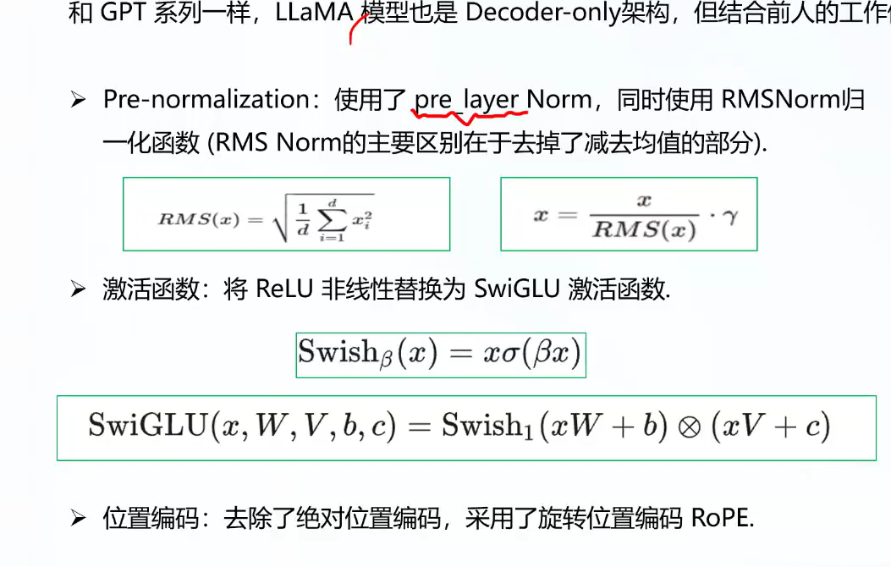

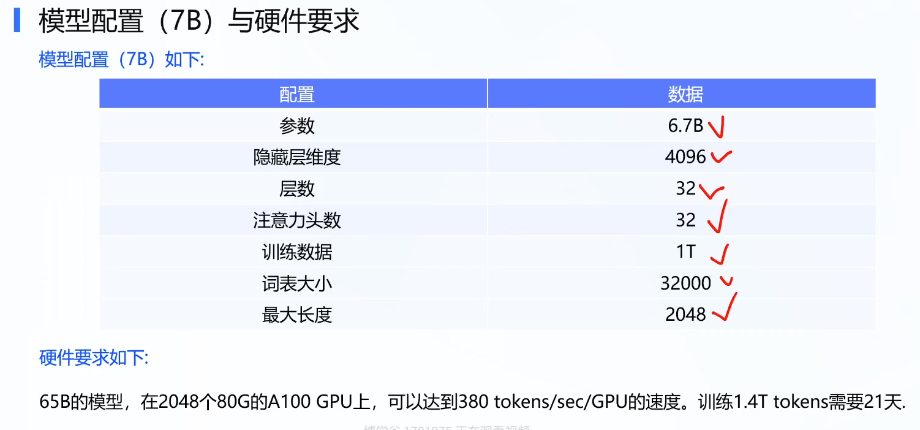

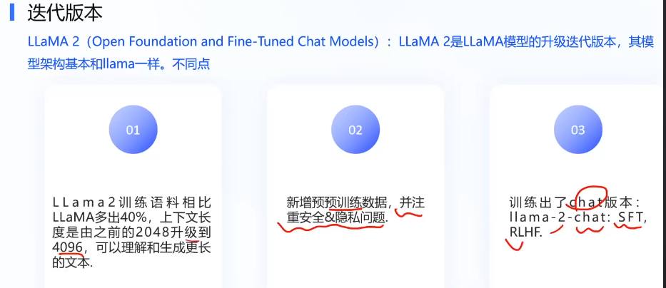

#### BLOOM

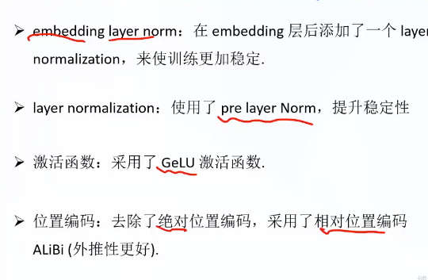

#### Baichuan

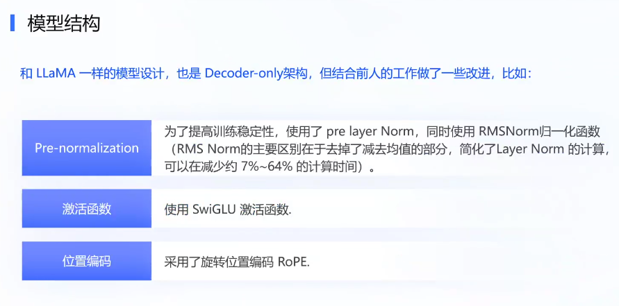

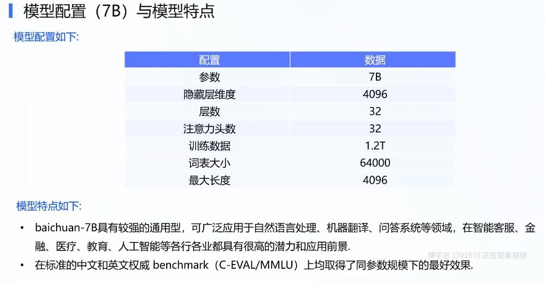

#### DEEPSEEK KIMI-K2   2024 12   2025 7

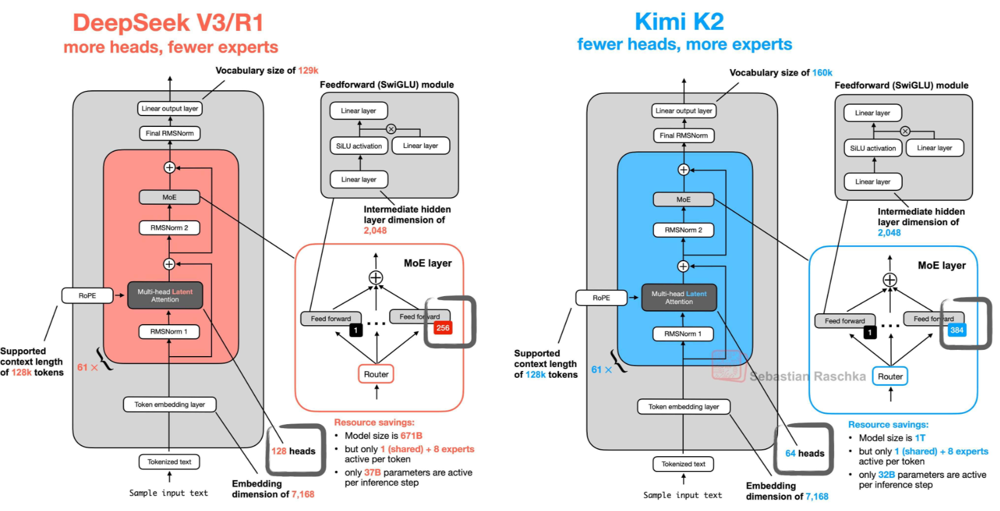

mlA  KV缓存加速推理

moe

#### QWEN

B 豆包 B 文心 A **Qwen** Qwen2.5（2025.05），10+尺寸、全开源；Hugging Face 衍生模型量全球第一 T 元宝

月之暗面  **kimi**  智谱 **GLM** 零一万物 Yi 百川 baichuan MiniMax abab

### 大模型的微调方法

#### 全量微调

更新预训练模型的所有参数

效果好

计算成本高 ，

数据量充足，算力充足

#### PEFT  参数高效微调

LORA  

通过低秩分解（如矩阵分解）模拟参数更新，仅训练低秩矩阵。

显存占用低，推理时可合并参数（无延迟）

QLoRA（结合量化，进一步降低显存）。

PREFIX-tuning  （变体P-tuning）

在输入钱添加可以学习的连续向量，冻结原模型参数。 

adpter Tuning

在Transformer层中插入小型神经网络（适配器模块），进训练适配器。

参数少，可插拔式设计

可能增加推理时间

“提示学习”时，是一个广泛的、利用提示来激发预训练模型能力的策略集合。

包括few-shot，one-shot,zero-shot这种

#### ** Prompt Tuning**

**方法**：仅优化输入层的软提示（soft prompts），类似Prefix Tuning但更轻量。

#### prefix/prompt-based Tuning 基于前缀/提示的微调  

NLP任务四种范式

tf-idf特征+朴素贝叶斯等机器算法

word2vec+LSTM

预训练模型+fine-tuning

预训练模型+prompt+预测

Fine-tuning

属于迁移学习，根据不同任务训练不同模型。一个任务训练一个模型。需要大量的监督预料。

> **提示学习（Prompt Learning）** 是一个**大的概念框架或范式**。它指的是**利用自然语言提示（Prompt）来引导预训练语言模型执行下游任务**的所有方法。核心思想是：**不改变或少改变模型内部参数**，而是通过设计或学习合适的输入（Prompt）来“激发”模型已有的知识。
>
> 核心思想：用提示词来激发模型解决下游任务的能力。
>
> 实现方式：设计硬提示  训练软提示 两种，称作人工提示工程，   prompt-tuning
>
> **提示工程**：通过添加模板的方法来避免额外的参数，让小模型在小样本或零样本场景下达到理想的效果。这属于提示学习的硬模板。让下游任务迁就预训练模型。将文本分类转化为与MLM一致的完形填空。
>
> **提示微调（PromptTuning）** 是**在提示学习框架下的一种特定技术**。它的特点是：
>
> 1. **软提示（Soft Prompts / Prompt Embeddings）**： 它学习的提示不是人类可读的自然语言单词（硬提示），而是一组**连续的、可训练的向量（嵌入）**。这些向量直接拼接在输入嵌入之前（有时也插入中间）。
> 2. **仅微调提示向量**： 在训练过程中，**冻结预训练语言模型的所有参数**，**只更新这些连续的提示向量**。这是它与微调（Fine-tuning）和部分提示学习方法（如Prefix-Tuning）的关键区别。
> 3. **端到端学习**： 这些提示向量是通过在特定下游任务的数据集上，根据任务的损失函数，以端到端的方式学习得到的。
> 4. 狭义上只训练提示向量，冻结模型参数。adapter会训练软提示。

# Prompt-tuning

在输入层添加科学系的prompt tokens

prefix Tuning  在每一层的输入钱添加可学习的 prefixvectors。效果比Prompt-tuning好。

P-Tuning v1/v2：改进的连续提示方法，引入了提示编码器（如LSTM或MLP）来生成提示向量，可能更鲁棒。

优点：参数效率高

去点：效果不如lora/adapter稳定

[CLS] i like the Disney films very much. [SEP]

原本使用 bert获得CLS表征，然后送入新增MLP作二分类

1.构建模板 ：给句子一个含有MASK标记的模板，拼接到原始的文本中。如：[CLS] i like the Disney films very much. [SEP]It was [MASK]。将其送入bert，复用MLM分类器，即可获得mask预测的各个token的概率分布。

标签词映射 verbalizer ：因为[MASK]支队部分词感兴趣，建立一个映射类，将预测词映射到类别中去。

训练：对已有label word 训练，之训练MLM head。

PET （为bert设计）  bert分类  微调  提示词微调 两种方法。

模板  文本加带有mask的短文本，如何构建模板很讲究

构建prompt it was 【MASK】，构建模板，将文本结合，输入至预训练模型中，训练任务目标和MLM目标一直，即识别被[MASK]掉的词。

标签词映射  设计映射也很讲究

需要人工构建 模板和标签此映射

不同的PVP对结果差异

MLM任务并非完全按照PVP模型进行训练的，在语义和分布上依然有差异。

引子：上面方法预训练魔心参数是可变的，本质是提示学习+fine-tuning的结合（这里学习的是模型，而不是提示词向量），在bert类上表现较好。对于不同的下游任务都要更新模型，后面就有了针对prompt调优的方法。

于是就有了软模版。可学习的向量代替提示词，冻结模型。节省了人工对不同任务设计模板，避免了训练整个模型。

人工还需要标签此映射

T5提出了 用同一个模型对不同的任务加载不同的模板，模板可训练，所谓的提示学习。

 P-tuning 

只对软模版参数进行优化。

伪标记通过encoder（mlp+lstm）成为软模版。训练后去点encoder。位置不固定。

 P-tuning V2

